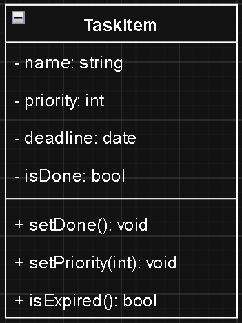
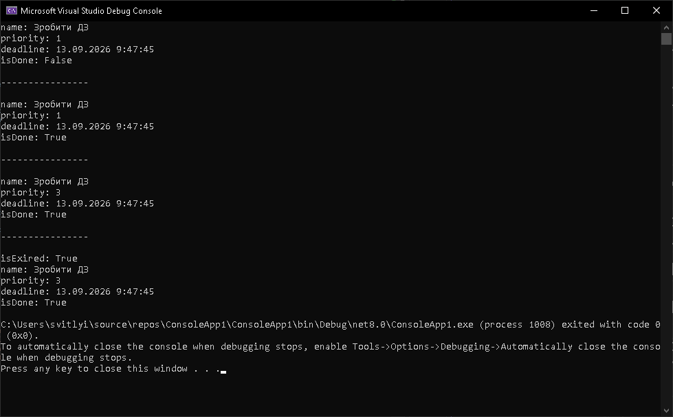

`Домашня робота №2`

## Практика проєктування та реалізації класів

За варіантами, наданими нижче, зпроєктувати клас та реалізувати його мовою C#.

Обов'язково додати перевірку коректної роботи класу.

---

### Приклад виконання

> Клас `TaskItem`: Моделює задачу в трекері завдань. Повинен мати назву, пріоритет, термін виконання та статус виконання. Методи дозволяють змінювати статус на виконаний, оновлювати пріоритет та перевіряти, чи прострочено дедлайн.

#### Спроєктований клас


#### Клас, реалізований мовою C#
```C#
class TaskItem
{
    private string name;
    private int priority;
    private DateTime deadline;
    private bool isDone;

    public TaskItem(string name, int priority, DateTime deadline)
    {
        this.name = name;
        this.priority = priority;
        this.deadline = deadline;
        this.isDone = false;
    }

    public void setDone()
    {
        this.isDone = true;
    }

    public void setPriority(int priority)
    {
        this.priority = priority;
    }

    public bool isExpired()
    {
        return deadline < DateTime.Now;
    }

    public void show()
    {
        Console.WriteLine($"name: {this.name}");
        Console.WriteLine($"priority: {this.priority}");
        Console.WriteLine($"deadline: {this.deadline}");
        Console.WriteLine($"isDone: {this.isDone}");
    }
}
```

#### Перевірка класу
```C#
static void Main(string[] args)
{
    TaskItem task1 = new TaskItem("Зробити ДЗ", 1, DateTime.Now.AddDays(-1));
    task1.show();
    Console.WriteLine("\n----------------\n");
    task1.setDone();
    task1.show();
    Console.WriteLine("\n----------------\n");
    task1.setPriority(3);
    task1.show();
    Console.WriteLine("\n----------------\n");
    Console.WriteLine($"isExired: {task1.isExpired()}");
    task1.show();
}
```

#### Робота класу


---

### Варіанти виконання:
| Студент | Клас | Вимоги |
| :---- | :---- | :---- |
| Весновський Георгій | `LibraryBook` | Моделює книгу в бібліотеці. Повинен містити поля для назви, автора, кількості сторінок та статусу видачі. Методи мають дозволяти видавати книгу читачеві, повертати її назад та перевіряти доступність. |
| Дрига Марк | `ShoppingItem` | Описує товар у кошику інтернет-магазину. Має містити назву, ціну за одиницю, кількість та категорію. Методи повинні підраховувати загальну вартість із урахуванням кількості та застосовувати персональну знижку. |
| Карпенко Георгій | `MovieTicket` | Представляє квиток у кінотеатр. Повинен зберігати назву фільму, дату сеансу, номер ряду, місце та ціну. Методи мають змінювати дату сеансу, та розраховувати вартість з надбавкою за вихідний день.|
| Кіріченко Максим | `StudentProfile` | Зберігає інформацію про студента коледжу. Містить прізвище, ім'я, номер групи та середній бал. Методи мають оновлювати середній бал на основі нових оцінок, змінювати групу та перевіряти право на стипендію.
| Колковий Владислав | `FitnessTracker` | Описує фітнес-браслет користувача. Повинен мати поля для пройдених кроків, спалених калорій, пульсу та цілі на день. Методи додають нові кроки під час тренування, оновлюють поточний пульс і перевіряють виконання денної норми. |
| Корнішина Богдана | `Recipe` | Моделює кулінарний рецепт. Містить назву страви, час приготування, кількість порцій та складність. Методи повинні масштабувати кількість інгредієнтів залежно від бажаної кількості порцій та виводити повний опис приготування. |
| Любезний Петро | `GameCharacter` | Описує персонажа рольової гри. Має поля для імені, рівня, здоров'я та сили атаки. Методи дозволяють завдавати шкоди ворогу, отримувати урон із зменшенням здоров'я та підвищувати рівень із ростом характеристик. |
| Паханцова Тетяна | `Pet` | Моделює домашню тварину. Повинен містити кличку, вид тварини, вік, рівень голоду та рівень радості. Методи мають дозволяти годувати тварину для зменшення голоду, гратися з нею (збільшувати радість) та перевіряти загальний стан. |
| Середенко Дмитро | `OnlineCourse` | Описує навчальний курс на платформі. Має назву, автора, загальну кількість годин та кількість зареєстрованих студентів. Методи повинні додавати нового студента, змінювати тривалість курсу та видавати сертифікат після завершення. |
| Скорик Тимур | `CoffeeMachine` | Моделює кавоварку. Містить рівень води, рівень кавових зерен, заповненість контейнера для відходів та стан готовності. Методи мають запускати приготування еспресо з перевіркою ресурсів, додавати воду, кавові зерна та очищувати контейнер. |
| Табасаранська Лілія | `HotelRoom` | Описує номер у готелі. Має номер кімнати, клас комфорту, вартість доби проживання та статус зайнятості. Методи повинні змінювати вартість проживання, оформлювати виселення та розраховувати фінальну вартість проживання. |
| Тищенко Діана | `Event` | Описує подію в календарі. Має назву події, дату, тривалість у годинах та список учасників. Методи повинні додавати нового учасника до списку, переносити подію на іншу дату та перевіряти збіг часу з іншими подіями. |


---
<p style="text-align: center">
    У MyStat потрібно завантажити код додатку та скриншоти його тестування.
</p>

---