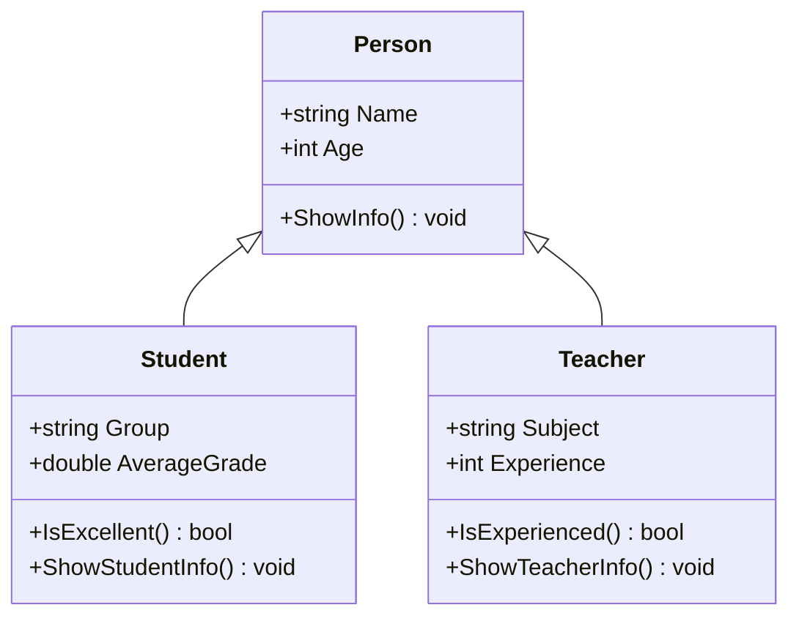

`Домашня робота №3`

## Наслідування: створення похідних класів

На основі готового класу `Employee` (працівник) створити мовою C# два похідні класи: `Developer` (розробник) і `Manager` (менеджер).

<details>
<summary><b>📄 Базовий клас Employee (дано)</b></summary>

```C#
namespace Company.Models;

internal class Employee
{
    private string name = "";
    private decimal salary;

    public Employee(string name, decimal salary)
    {
        Name = name;
        Salary = salary;
    }

    public string Name
    {
        get { return name; }
        set
        {
            if (string.IsNullOrWhiteSpace(value))
            {
                Console.WriteLine("Помилка: ім'я не може бути порожнім");
                return;
            }
            name = value;
        }
    }

    // Змінювати зарплату можуть лише сам клас і його нащадки
    public decimal Salary
    {
        get { return salary; }
        protected set
        {
            if (value <= 0)
            {
                Console.WriteLine($"Помилка: зарплата {value} неприпустима");
                return;
            }
            salary = value;
        }
    }

    public void ShowInfo()
    {
        Console.WriteLine($"{Name}, зарплата: {Salary} грн");
    }
}
```

</details>

### Клас Developer : Employee

| Властивість | Тип | Опис |
| :---- | :---- | :---- |
| `Language` | ![string-badge] | Мова програмування |
| `Level` | ![string-badge] | Лише `Junior`, `Middle` або `Senior`; змінюється тільки через `Promote()` |

| Метод | Повертає | Опис |
| :---- | :---- | :---- |
| `Promote()` | ![void-badge] | `Junior` → `Middle` → `Senior`, зарплата +15 000 грн. На `Senior` — лише повідомлення |
| `ShowDeveloperInfo()` | ![void-badge] | Викликає `ShowInfo()` і додає мову та рівень |

### Клас Manager : Employee

| Властивість | Тип | Опис |
| :---- | :---- | :---- |
| `Department` | ![string-badge] | Відділ |
| `SubordinatesCount` | ![int-badge] | Кількість підлеглих, не від'ємна |

| Метод | Повертає | Опис |
| :---- | :---- | :---- |
| `CalculateBonus()` | ![decimal-badge] | Премія: 1 000 грн за кожного підлеглого |
| `ShowManagerInfo()` | ![void-badge] | Викликає `ShowInfo()` і додає відділ та кількість підлеглих |

### Вимоги

- клас `Employee` **не змінювати**; конструктори похідних класів викликають його через **`base(...)`**
- нові дані — **властивості**, з перевіркою там, де є обмеження
- методи виведення називати **по-своєму**, а не `ShowInfo` (інакше — попередження `CS0108`)
- кожен клас — в **окремому файлі** в папці `Models`
- у `Main`: **по два об'єкти** кожного класу, виклик усіх методів, перевірка некоректних значень

---

### Приклад виконання

> Клас `Person` (ім'я, вік) → похідні класи `Student` (група, середній бал) і `Teacher` (предмет, стаж). Додаткові методи: `IsExcellent()` — бал від 10, `IsExperienced()` — стаж від 10 років.



<details>
<summary><b>📄 Models/Person.cs</b> — базовий клас (дано)</summary>

```C#
namespace College.Models;

internal class Person
{
    private string name = "";
    private int age;

    public Person(string name, int age)
    {
        Name = name;
        Age = age;
    }

    public string Name
    {
        get { return name; }
        set
        {
            if (string.IsNullOrWhiteSpace(value))
            {
                Console.WriteLine("Помилка: ім'я не може бути порожнім");
                return;
            }
            name = value;
        }
    }

    public int Age
    {
        get { return age; }
        set
        {
            if (value < 0 || value > 120)
            {
                Console.WriteLine($"Помилка: вік {value} неприпустимий");
                return;
            }
            age = value;
        }
    }

    public void ShowInfo()
    {
        Console.WriteLine($"{Name}, {Age} р.");
    }
}
```

</details>

<details>
<summary><b>📄 Models/Student.cs</b></summary>

```C#
namespace College.Models;

internal class Student : Person
{
    private double averageGrade;

    public Student(string name, int age, string group, double averageGrade) : base(name, age)
    {
        Group = group;
        AverageGrade = averageGrade;
    }

    public string Group { get; set; }

    public double AverageGrade
    {
        get { return averageGrade; }
        set
        {
            if (value < 1 || value > 12)
            {
                Console.WriteLine($"Помилка: середній бал {value} неприпустимий");
                return;
            }
            averageGrade = value;
        }
    }

    public bool IsExcellent()
    {
        return AverageGrade >= 10;
    }

    public void ShowStudentInfo()
    {
        ShowInfo(); // успадкований метод виводить ім'я та вік
        Console.WriteLine($"  група: {Group}, середній бал: {AverageGrade}");
    }
}
```

</details>

<details>
<summary><b>📄 Models/Teacher.cs</b></summary>

```C#
namespace College.Models;

internal class Teacher : Person
{
    private int experience;

    public Teacher(string name, int age, string subject, int experience) : base(name, age)
    {
        Subject = subject;
        Experience = experience;
    }

    public string Subject { get; set; }

    public int Experience
    {
        get { return experience; }
        set
        {
            if (value < 0)
            {
                Console.WriteLine($"Помилка: стаж {value} неприпустимий");
                return;
            }
            experience = value;
        }
    }

    public bool IsExperienced()
    {
        return Experience >= 10;
    }

    public void ShowTeacherInfo()
    {
        ShowInfo(); // успадкований метод виводить ім'я та вік
        Console.WriteLine($"  предмет: {Subject}, стаж: {Experience} р.");
    }
}
```

</details>

<details>
<summary><b>📄 Program.cs</b> — перевірка класів</summary>

```C#
using College.Models;

namespace College;

class Program
{
    static void Main(string[] args)
    {
        Student olena = new Student("Олена", 17, "П-21", 10.5);
        Student maksym = new Student("Максим", 16, "П-11", 8.2);
        Teacher iryna = new Teacher("Ірина Петрівна", 42, "Програмування", 15);
        Teacher oleh = new Teacher("Олег Іванович", 26, "Математика", 3);

        olena.ShowStudentInfo();
        maksym.ShowStudentInfo();
        if (olena.IsExcellent())
        {
            Console.WriteLine($"{olena.Name} навчається на відмінно");
        }
        Console.WriteLine();

        iryna.ShowTeacherInfo();
        oleh.ShowTeacherInfo();
        if (iryna.IsExperienced())
        {
            Console.WriteLine($"{iryna.Name} має великий досвід");
        }
        Console.WriteLine();

        // Перевірка: некоректні значення відхиляються
        maksym.AverageGrade = 15;
        oleh.Experience = -2;
        oleh.Age = 200;
    }
}
```

</details>

#### Робота програми
```text
Олена, 17 р.
  група: П-21, середній бал: 10,5
Максим, 16 р.
  група: П-11, середній бал: 8,2
Олена навчається на відмінно

Ірина Петрівна, 42 р.
  предмет: Програмування, стаж: 15 р.
Олег Іванович, 26 р.
  предмет: Математика, стаж: 3 р.
Ірина Петрівна має великий досвід

Помилка: середній бал 15 неприпустимий
Помилка: стаж -2 неприпустимий
Помилка: вік 200 неприпустимий
```

---

### 📖 Пов'язані уроки

- [5. Наслідування: базовий та похідні класи](/Lessons/5_Inheritance.md) — основна тема
- [2. Інкапсуляція: модифікатори доступу та властивості](/Lessons/2_Encapsulation.md) — властивості з перевіркою
- [3. Організація проєкту: кілька файлів](/Lessons/3_Project_Structure.md) — класи в окремих файлах

---
<p align="center">
    У MyStat потрібно завантажити код додатку та скриншоти його тестування.
</p>

---
[string-badge]:https://img.shields.io/badge/string-green?style=flat
[int-badge]:https://img.shields.io/badge/int-blue?style=flat
[decimal-badge]:https://img.shields.io/badge/decimal-blue?style=flat
[void-badge]:https://img.shields.io/badge/void-lightgrey?style=flat
