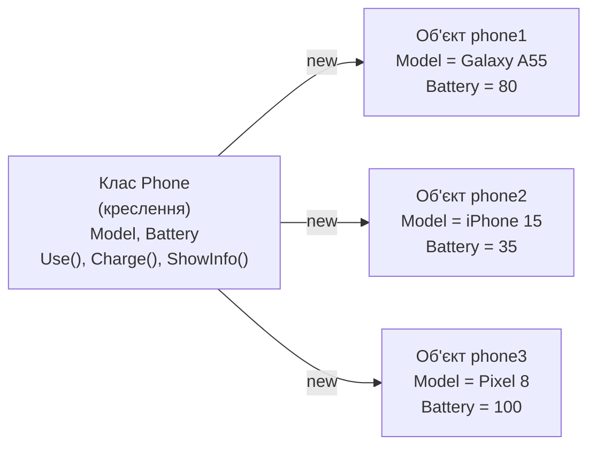
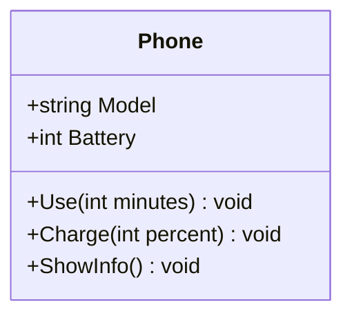
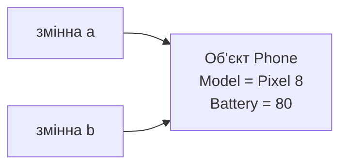
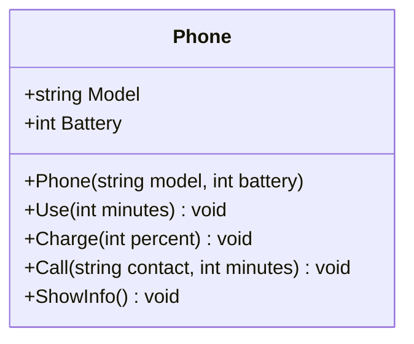

# 1. Вступ до ООП: класи, об'єкти та конструктор

![block-badge] ![lang-badge]

## Зміст
1. [Навіщо потрібне ООП](#навіщо-потрібне-ооп)
2. [Об'єкт: стан і поведінка](#обєкт-стан-і-поведінка)
3. [Клас та об'єкт](#клас-та-обєкт)
4. [Оголошення класу](#оголошення-класу)
5. [Створення об'єктів](#створення-обєктів)
6. [Кілька незалежних об'єктів](#кілька-незалежних-обєктів)
7. [Конструктор](#конструктор)
8. [Повний приклад](#повний-приклад)
9. [Порівняння процедурного підходу та ООП](#порівняння-процедурного-підходу-та-ооп)
10. [Класи, якими ви вже користувались](#класи-якими-ви-вже-користувались)
11. [Підсумок](#підсумок)
12. [Запитання для самоперевірки](#запитання-для-самоперевірки)
13. [Довідкові матеріали](#довідкові-матеріали)

---

## Навіщо потрібне ООП

> **Об'єктно-орієнтоване програмування** (Object-Oriented Programming, ООП) — це підхід до написання програм, за якого програма складається з _об'єктів, що поєднують у собі дані та дії над цими даними_.

До цього моменту ви писали програми у **процедурному стилі** (procedural programming): окремо — змінні з даними, окремо — функції (методи), які ці дані обробляють. Для маленьких програм це працює. Але щойно даних стає багато, код починає розсипатися.

### Процедурний підхід: приклад

Опишемо два смартфони: у кожного є модель і рівень заряду. Смартфоном можна користуватися (заряд зменшується) і можна вивести інформацію про нього.

```C#
class Program
{
    static void Main(string[] args)
    {
        // Смартфон №1
        string phone1Model = "Galaxy A55";
        int phone1Battery = 80;

        // Смартфон №2
        string phone2Model = "iPhone 15";
        int phone2Battery = 35;

        phone1Battery = UsePhone(phone1Battery, 30);
        phone2Battery = UsePhone(phone2Battery, 50);

        ShowPhone(phone1Model, phone1Battery);
        ShowPhone(phone2Model, phone2Battery);
    }

    static int UsePhone(int battery, int minutes)
    {
        battery -= minutes / 2; // 1% заряду за 2 хвилини
        if (battery < 0)
        {
            battery = 0;
        }
        return battery;
    }

    static void ShowPhone(string model, int battery)
    {
        Console.WriteLine($"{model}: заряд {battery}%");
    }
}
```

Результат роботи:

```text
Galaxy A55: заряд 65%
iPhone 15: заряд 10%
```

> [!TIP]
> **Порада:** якщо замість українських літер у консолі з'являються знаки питання, додайте першим рядком програми (у `Main` або на початку `Program.cs`):
> ```C#
> Console.OutputEncoding = System.Text.Encoding.UTF8;
> ```
> Цей рядок вмикає в консолі кодування UTF-8, яке підтримує будь-які символи. У прикладах уроків його опущено, щоб не захаращувати код.

Програма працює. Але подивіться на проблеми:

- **дані розкидані** — модель і заряд одного телефону живуть в окремих змінних, і їх пов'язує лише назва `phone1...`
- **легко помилитися** — виклик `ShowPhone(phone1Model, phone2Battery)` компілятор пропустить, хоча це повна нісенітниця: модель одного телефону із зарядом іншого
- **погано масштабується** — для 10 телефонів буде 20 змінних, а якщо додати ще й власника телефону — 30
- **будь-яку зміну важко вносити** — додали нову характеристику, і треба переписати параметри всіх функцій

### Той самий код в ООП-стилі

```C#
Phone phone1 = new Phone("Galaxy A55", 80);
Phone phone2 = new Phone("iPhone 15", 35);

phone1.Use(30);
phone2.Use(50);

phone1.ShowInfo();
phone2.ShowInfo();
```

Результат роботи такий самий:

```text
Galaxy A55: заряд 65%
iPhone 15: заряд 10%
```

Тепер кожен телефон — це **одна цілісна сутність**: його модель, заряд і дії над ним зібрані разом. Переплутати заряд одного телефону із зарядом іншого просто неможливо. Як саме це влаштовано — розберемо в цьому уроці.

**Навіщо потрібне ООП:**

- моделювання предметів реального світу в коді (телефон, студент, банківський рахунок, персонаж гри)
- поєднання даних і дій над ними в одному місці
- повторне використання коду: один раз описали — створюємо скільки завгодно
- зручна робота у великих проєктах і в команді

---

## Об'єкт: стан і поведінка

> **Об'єкт** — це програмна модель конкретної сутності, яка має **стан** (_які в неї дані_) і **поведінку** (_що вона вміє робити_).

Подивіться на будь-який предмет навколо — його можна описати саме так:

| Об'єкт | Стан (поля) | Поведінка (методи) |
| :---- | :---- | :---- |
| **Смартфон** | модель, рівень заряду, гучність | зателефонувати, зарядити, змінити гучність |
| **Банківський рахунок** | номер, власник, баланс | поповнити, зняти кошти |
| **Персонаж гри** | ім'я, рівень, здоров'я | атакувати, отримати шкоду, підвищити рівень |
| **Кавоварка** | рівень води, кількість зерен | приготувати каву, додати воду |

У C# стан об'єкта зберігається в **полях** (fields) — це змінні всередині об'єкта. Поведінка описується **методами** (methods) — це функції, які працюють з полями свого об'єкта.

> [!IMPORTANT]
> **Ключова ідея:** об'єкт = **стан** (поля) + **поведінка** (методи). Дані й дії над ними більше не живуть окремо — вони зібрані разом.

---

## Клас та об'єкт

> **Клас** (class) — це _опис (креслення)_, за яким створюються об'єкти. **Об'єкт** — це _конкретний екземпляр_ (instance) класу.

Аналогія: за одним кресленням будинку можна збудувати цілу вулицю будинків. Креслення одне, будинки — різні: різного кольору, з різними мешканцями. Але структура у всіх однакова, бо збудовані вони за одним кресленням.

Так само з класами: клас `Phone` описує, **які** поля й методи є в будь-якого смартфона. А конкретні телефони — `Galaxy A55` із зарядом 80% та `iPhone 15` із зарядом 35% — це об'єкти цього класу.



На схемі: з одного класу `Phone` за допомогою `new` створено три різні об'єкти, кожен — зі своїми значеннями полів.

| | **Клас** | **Об'єкт** |
| :---- | :---- | :---- |
| **Що це** | Опис, шаблон, креслення | Конкретний екземпляр за цим описом |
| **Скільки їх** | Один | Скільки завгодно |
| **Що містить** | Перелік полів і методів | Конкретні значення полів |
| **Приклад** | `Phone` | `Galaxy A55` із зарядом 80% |
| **Коли з'являється** | Коли ви пишете код | Під час роботи програми (через `new`) |

---

## Оголошення класу

Клас оголошується ключовим словом `class`, після якого йде ім'я класу, а у фігурних дужках — його поля та методи.

```C#
class Phone
{
    // Поля — стан об'єкта
    public string Model;
    public int Battery;

    // Методи — поведінка об'єкта
    public void Use(int minutes)
    {
        Battery -= minutes / 2; // 1% заряду за 2 хвилини
        if (Battery < 0)
        {
            Battery = 0;
        }
    }

    public void Charge(int percent)
    {
        Battery += percent;
        if (Battery > 100)
        {
            Battery = 100;
        }
    }

    public void ShowInfo()
    {
        Console.WriteLine($"{Model}: заряд {Battery}%");
    }
}
```

Зверніть увагу: всередині методів поля `Model` і `Battery` використовуються **напряму**, без жодних параметрів. Метод завжди працює з полями _того об'єкта_, для якого його викликали.

> [!WARNING]
> **Часта помилка:** за звичкою з процедурних програм написати `static` перед методом чи полем класу `Phone`:
> ```C#
> public static void ShowInfo()
> {
>     Console.WriteLine(Model); // помилка компіляції
> }
> ```
> ```text
> error CS0120: An object reference is required for the non-static field, method, or property 'Phone.Model'
> ```
> Статичний метод належить класу в цілому, а не конкретному телефону, тому він «не знає», модель якого телефону виводити. Зі `static`-полем ще гірше: програма скомпілюється, але всі телефони матимуть **один спільний** заряд. Тому поля й методи об'єктів пишуться **без** `static`. А перед `Main` слово `static` залишається: програма запускається ще до того, як створено хоч один об'єкт.

### Поля класу Phone

| Поле | Тип | Опис |
| :---- | :---- | :---- |
| `Model` | ![string-badge] | Модель телефону |
| `Battery` | ![int-badge] | Рівень заряду у відсотках (0–100) |

### Методи класу Phone

| Метод | Параметри | Повертає | Опис |
| :---- | :---- | :---- | :---- |
| `Use` | ![int-badge] minutes | ![void-badge] | Використання телефону: заряд зменшується на 1% за кожні 2 хвилини |
| `Charge` | ![int-badge] percent | ![void-badge] | Заряджання, але не більше ніж до 100% |
| `ShowInfo` | — | ![void-badge] | Виведення інформації про телефон |

Той самий клас у вигляді діаграми класів (UML):



Верхня частина діаграми — назва класу, далі — поля, нижче — методи. Знак `+` означає `public`.

### Правила оголошення

- ім'я класу — іменник у **PascalCase**: `Phone`, `BankAccount`, `GameCharacter`
- публічні поля й методи також пишуться в PascalCase: `Model`, `ShowInfo()`
- клас описує **одну** сутність: `Phone` не повинен зберігати дані про власника банківського рахунку

> [!NOTE]
> **Зверніть увагу:** слово `public` перед полями й методами означає «доступно ззовні класу». Без нього до поля не можна було б звернутися з `Main`. Детально про модифікатори доступу — в наступному уроці.

### Де писати клас

Поки що всі класи пишемо в одному файлі `Program.cs` — **поруч** із класом `Program`, а не всередині методу `Main`:

```C#
class Phone
{
    // поля та методи...
}

class Program
{
    static void Main(string[] args)
    {
        // тут створюємо об'єкти та працюємо з ними
    }
}
```

> [!TIP]
> **Порада:** якщо ваш `Program.cs` не містить класу `Program` і методу `Main` (так виглядає новий проєкт за замовчуванням — це називається _інструкції верхнього рівня_, top-level statements), оголошуйте свої класи **в кінці файлу**, після основного коду. Щоб отримати звичну структуру з `Main`, під час створення проєкту поставте галочку **Do not use top-level statements**. Як розкласти класи по окремих файлах — розглянемо в уроці 3.

---

## Створення об'єктів

Клас — лише опис. Щоб отримати реальний телефон, з яким можна працювати, потрібно **створити об'єкт** за допомогою оператора `new`:

```C#
Phone phone = new Phone();
```

Розберемо цей рядок:

| Частина | Що означає |
| :---- | :---- |
| **`Phone`** (зліва) | Тип змінної — у ній зберігатиметься об'єкт класу `Phone` |
| **`phone`** | Ім'я змінної |
| **`new`** | Оператор, який створює новий об'єкт у пам'яті |
| **`Phone()`** | Виклик конструктора — спеціального методу, що готує об'єкт до роботи (про нього — нижче) |

### Доступ через крапку

До полів і методів об'єкта звертаються **через крапку**: `об'єкт.Поле` або `об'єкт.Метод()`.

```C#
static void Main(string[] args)
{
    Phone phone = new Phone();
    phone.ShowInfo();

    phone.Model = "Galaxy A55";
    phone.Battery = 80;
    phone.ShowInfo();

    phone.Use(30);
    phone.ShowInfo();

    phone.Charge(50);
    phone.ShowInfo();
}
```

Результат роботи:

```text
: заряд 0%
Galaxy A55: заряд 80%
Galaxy A55: заряд 65%
Galaxy A55: заряд 100%
```

Подивіться на перший рядок виводу: одразу після створення телефон не має моделі, а заряд дорівнює `0`. Це **значення за замовчуванням** — їх отримують поля, яким ми нічого не присвоїли:

| Тип поля | Значення за замовчуванням |
| :---- | :---- |
| ![int-badge] ![double-badge] | `0` |
| ![bool-badge] | `false` |
| ![string-badge] та інші класи | `null` (порожнє посилання, «нічого») |

> [!NOTE]
> **Зверніть увагу:** Visual Studio може підкреслити поле `Model` зеленою хвилястою лінією з попередженням `CS8618` — компілятор нагадує, що рядкове поле після створення об'єкта залишиться `null`. Це **попередження**, а не помилка: програма запуститься. Як позбутися його правильно — побачите в розділі про конструктор.

> [!WARNING]
> **Часта помилка:** оголосити змінну, але забути створити об'єкт:
> ```C#
> Phone phone;       // змінна є, а об'єкта немає
> phone.Model = "X"; // помилка компіляції
> ```
> ```text
> error CS0165: Use of unassigned local variable 'phone'
> ```
> Без `new` об'єкт не з'являється. А якщо змінна містить `null`, компілятор звернення через крапку пропустить, але програма аварійно завершиться під час роботи з помилкою `NullReferenceException`.

---

## Кілька незалежних об'єктів

З одного класу можна створити скільки завгодно об'єктів. **Кожен об'єкт має власні копії полів**: зміна одного об'єкта ніяк не впливає на інші.

```C#
static void Main(string[] args)
{
    Phone phone1 = new Phone();
    phone1.Model = "Galaxy A55";
    phone1.Battery = 80;

    Phone phone2 = new Phone();
    phone2.Model = "iPhone 15";
    phone2.Battery = 35;

    phone1.Use(60);

    phone1.ShowInfo();
    phone2.ShowInfo();
}
```

Результат роботи:

```text
Galaxy A55: заряд 50%
iPhone 15: заряд 35%
```

Метод `Use` викликали лише для `phone1` — тому заряд зменшився тільки в нього. `phone2` залишився без змін.

> [!WARNING]
> **Часта плутанина:** присвоєння `Phone b = a;` **не створює копію** об'єкта! Обидві змінні вказуватимуть на **той самий** об'єкт.
>
> ```C#
> Phone a = new Phone();
> a.Model = "Pixel 8";
> a.Battery = 50;
>
> Phone b = a; // НЕ копія: b вказує на той самий об'єкт
> b.Charge(30);
>
> a.ShowInfo(); // Pixel 8: заряд 80%
> b.ShowInfo(); // Pixel 8: заряд 80%
> ```
>
> Ми заряджали «телефон `b`», а змінився й `a` — бо це один і той самий телефон. Новий об'єкт з'являється **тільки** там, де написано `new`.



На схемі: дві змінні, але об'єкт — один. Змінна, тип якої — клас, зберігає не сам об'єкт, а **посилання** (reference) на нього.

---

## Конструктор

Повернімося до проблеми з розділу «Створення об'єктів»: після `new Phone()` телефон існує, але без моделі й з нульовим зарядом. Щоб він став «нормальним», треба не забути заповнити всі поля вручну. А якщо полів десять? А якщо забули одне?

> **Конструктор** (constructor) — це спеціальний метод класу, який **автоматично викликається під час створення об'єкта** через `new`. Його завдання — _зробити об'єкт коректним одразу з моменту появи_.

### Конструктор з параметрами

```C#
class Phone
{
    public string Model;
    public int Battery;

    // Конструктор
    public Phone(string model, int battery)
    {
        Model = model;
        Battery = battery;
    }

    // методи Use, Charge, ShowInfo — без змін...
}
```

Тепер модель і заряд передаються одразу під час створення:

```C#
Phone phone = new Phone("Galaxy A55", 80);
phone.ShowInfo();
```

Результат роботи:

```text
Galaxy A55: заряд 80%
```

Один рядок замість трьох, і забути передати модель чи заряд уже неможливо — без аргументів компілятор просто не дасть створити об'єкт. До речі, попередження `CS8618` теж зникло: тепер конструктор гарантовано записує значення в `Model`.

**Чим конструктор відрізняється від звичайного методу:**

- його ім'я **збігається з іменем класу**: `Phone`
- у нього **немає типу результату** — навіть `void` не пишеться
- його не можна викликати як звичайний метод (`phone.Phone(...)`) — лише через `new`, і тоді він спрацьовує **автоматично**
- значення в дужках після `new Phone(...)` — це аргументи конструктора

> [!NOTE]
> **Зверніть увагу:** параметри конструктора (`model`, `battery`) пишуться з маленької літери, а поля (`Model`, `Battery`) — з великої. Тому рядок `Model = model;` читається однозначно: «полю `Model` присвоїти значення параметра `model`». Іноді, щоб підкреслити, що йдеться саме про поле об'єкта, пишуть `this.Model = model;` — слово `this` означає «цей об'єкт».

### Конструктор за замовчуванням

Але ж у попередніх розділах ми писали `new Phone()` і ніякого конструктора не оголошували. Як це працювало?

Якщо в класі **немає жодного** конструктора, компілятор автоматично додає **конструктор за замовчуванням** — без параметрів і з порожнім тілом. Він нічого не присвоює, тому поля залишаються зі значеннями за замовчуванням (`0`, `null`), які кожен новий об'єкт отримує ще до виклику конструктора.

Цей неявний конструктор **зникає**, щойно ви пишете свій. Тож після додавання конструктора з параметрами старий код перестане компілюватися:

```C#
Phone phone = new Phone(); // помилка!
```

Помилка компіляції:

```text
error CS7036: There is no argument given that corresponds to the required parameter 'model' of 'Phone.Phone(string, int)'
```

Компілятор каже: «конструктор вимагає значення для параметра `model`, а ви його не передали».

Конструктор без параметрів можна написати й самостійно — наприклад, щоб задати осмислені значення за замовчуванням:

```C#
class Phone
{
    public string Model;
    public int Battery;

    public Phone()
    {
        Model = "Невідома модель";
        Battery = 100;
    }

    // методи...
}
```

```C#
Phone phone = new Phone();
phone.ShowInfo();
```

Результат роботи:

```text
Невідома модель: заряд 100%
```

В одному класі може бути і конструктор без параметрів, і конструктор з параметрами одночасно — це називається _перевантаженням конструкторів_. Поки що нам достатньо одного конструктора на клас.

> [!IMPORTANT]
> **Ключова ідея:** конструктор гарантує, що всі потрібні поля **заповнені** одразу після створення об'єкта. Не можна отримати «телефон без моделі», якщо конструктор вимагає модель.

> [!NOTE]
> **Зверніть увагу:** наш конструктор поки не перевіряє значення: `new Phone("Pixel 8", 150)` створить телефон із зарядом 150%. До того ж поля публічні, тож зіпсувати їх можна будь-коли: `phone.Battery = -5;`. Як захистити дані об'єкта — тема наступного уроку.

---

## Повний приклад

Зберемо все разом і додамо телефону ще одну дію — дзвінок. Зверніть увагу: метод `Call` всередині викликає інший метод того самого об'єкта — `Use`.

```C#
class Phone
{
    // Поля
    public string Model;
    public int Battery;

    // Конструктор
    public Phone(string model, int battery)
    {
        Model = model;
        Battery = battery;
    }

    // Методи
    public void Use(int minutes)
    {
        Battery -= minutes / 2; // 1% заряду за 2 хвилини
        if (Battery < 0)
        {
            Battery = 0;
        }
    }

    public void Charge(int percent)
    {
        Battery += percent;
        if (Battery > 100)
        {
            Battery = 100;
        }
    }

    public void Call(string contact, int minutes)
    {
        if (Battery == 0)
        {
            Console.WriteLine($"{Model}: неможливо зателефонувати, телефон розряджено");
            return;
        }
        Console.WriteLine($"{Model}: виклик абонента {contact} ({minutes} хв)");
        Use(minutes);
    }

    public void ShowInfo()
    {
        Console.WriteLine($"{Model}: заряд {Battery}%");
    }
}

class Program
{
    static void Main(string[] args)
    {
        Phone myPhone = new Phone("Galaxy A55", 80);
        Phone friendPhone = new Phone("iPhone 15", 10);

        myPhone.ShowInfo();
        friendPhone.ShowInfo();
        Console.WriteLine();

        myPhone.Call("Мама", 20);
        friendPhone.Call("Андрій", 40);
        friendPhone.Call("Андрій", 5);
        Console.WriteLine();

        friendPhone.Charge(50);
        myPhone.ShowInfo();
        friendPhone.ShowInfo();
    }
}
```

Результат роботи:

```text
Galaxy A55: заряд 80%
iPhone 15: заряд 10%

Galaxy A55: виклик абонента Мама (20 хв)
iPhone 15: виклик абонента Андрій (40 хв)
iPhone 15: неможливо зателефонувати, телефон розряджено

Galaxy A55: заряд 70%
iPhone 15: заряд 50%
```

Діаграма фінальної версії класу:



На діаграмі: до класу додано конструктор і метод `Call`.

> [!IMPORTANT]
> **Ключова ідея:** кожен об'єкт «пам'ятає» свій стан. Дзвінок з `friendPhone` розрядив саме його, а `myPhone` продовжує працювати зі своїм зарядом. У процедурному стилі для цього довелося б вручну передавати правильні змінні в кожну функцію.

---

## Порівняння процедурного підходу та ООП

| Критерій | Процедурний підхід | ООП |
| :---- | :---- | :---- |
| **Основна одиниця програми** | Функція (метод) | Об'єкт |
| **Де зберігаються дані** | В окремих змінних, передаються у функції параметрами | Усередині об'єкта, у його полях |
| **Зв'язок даних і дій** | Слабкий: функція «не знає», чиї дані їй передали | Сильний: метод працює з полями свого об'єкта |
| **Ризик переплутати дані** | Високий | Низький |
| **Масштабування** | Більше сутностей → більше змінних і параметрів | Більше сутностей → просто більше об'єктів |
| **Типові мови** | C, Pascal | C#, Java, Python, C++ |

**Головна різниця** — у процедурному стилі програма _робить щось із даними_, а в ООП програма складається з _об'єктів, які самі вміють щось робити зі своїми даними_. Замість `ShowPhone(model, battery)` ми пишемо `phone.ShowInfo()` — «телефоне, покажи себе».

> [!NOTE]
> **Зверніть увагу:** ООП не скасовує все, що ви вивчили раніше. Змінні, умови, цикли та методи нікуди не зникають — вони просто організовуються всередині класів.

---

## Класи, якими ви вже користувались

Насправді ви працюєте з об'єктами вже давно — просто класи за вас написали розробники .NET:

| Клас | Створення об'єкта | Використання | Що це означає |
| :---- | :---- | :---- | :---- |
| **[Random](https://learn.microsoft.com/dotnet/api/system.random)** | `Random rnd = new Random();` | `rnd.Next(1, 7)` | Створили об'єкт генератора і викликали його метод |
| **[List\<T\>](https://learn.microsoft.com/dotnet/api/system.collections.generic.list-1)** | `List<int> numbers = new List<int>();` | `numbers.Add(5)` | Кожен список — окремий об'єкт зі своїми елементами |
| **[String](https://learn.microsoft.com/dotnet/api/system.string)** | `string name = "Олена";` | `name.ToUpper()` | Рядок — теж об'єкт, у нього є свої методи |

Рядки — особливий випадок: C# дозволяє створювати їх без `new`, просто записавши текст у лапках.

Тепер ви розумієте, що означає запис `new Random()`: це створення об'єкта класу `Random` з викликом його конструктора. А `rnd.Next(1, 7)` — виклик методу цього об'єкта через крапку. Точнісінько як `new Phone(...)` і `phone.Call(...)`.

Класи лежать в основі більшості сучасних технологій: в ігровому рушії [Unity](https://unity.com/) кожен скрипт поведінки персонажа — це клас мовою C#, а в мобільних застосунках кожен екран, кнопка й повідомлення — об'єкти відповідних класів.

---

## Підсумок

- **ООП** — підхід, за якого програма складається з об'єктів, що поєднують дані та дії над ними
- **об'єкт** = стан (поля) + поведінка (методи)
- **клас** — креслення, **об'єкт** — конкретний екземпляр, створений через `new`; до членів об'єкта звертаються через крапку
- кожен об'єкт має **власні** значення полів, але присвоєння `b = a` не копіює об'єкт, а лише посилання на нього
- **конструктор** викликається автоматично під час `new` і заповнює поля об'єкта одразу після створення

---

## Запитання для самоперевірки

1. Які проблеми процедурного підходу вирішує ООП?
2. Що таке стан і поведінка об'єкта? Наведіть приклад для об'єкта «Велосипед».
3. Чим клас відрізняється від об'єкта? Скільки об'єктів можна створити з одного класу?
4. Що робить оператор `new`?
5. Які значення матимуть поля `int`, `bool` і `string` у щойно створеного об'єкта, якщо в класі не оголошено жодного конструктора?
6. Створили `Phone a = new Phone("Pixel 8", 50);`, потім `Phone b = a;` і `b.Charge(30);`. Який заряд буде в `a`? Чому?
7. Чим конструктор відрізняється від звичайного методу?
8. Чому після оголошення конструктора з параметрами запис `new Phone()` перестає компілюватися?

---

## Довідкові матеріали

- [Об'єктно-орієнтоване програмування](https://uk.wikipedia.org/wiki/%D0%9E%D0%B1%27%D1%94%D0%BA%D1%82%D0%BD%D0%BE-%D0%BE%D1%80%D1%96%D1%94%D0%BD%D1%82%D0%BE%D0%B2%D0%B0%D0%BD%D0%B5_%D0%BF%D1%80%D0%BE%D0%B3%D1%80%D0%B0%D0%BC%D1%83%D0%B2%D0%B0%D0%BD%D0%BD%D1%8F) — `uk.wikipedia.org`
- [Клас (програмування)](https://uk.wikipedia.org/wiki/%D0%9A%D0%BB%D0%B0%D1%81_(%D0%BF%D1%80%D0%BE%D0%B3%D1%80%D0%B0%D0%BC%D1%83%D0%B2%D0%B0%D0%BD%D0%BD%D1%8F)) — `uk.wikipedia.org`
- [Процедурне програмування](https://uk.wikipedia.org/wiki/%D0%9F%D1%80%D0%BE%D1%86%D0%B5%D0%B4%D1%83%D1%80%D0%BD%D0%B5_%D0%BF%D1%80%D0%BE%D0%B3%D1%80%D0%B0%D0%BC%D1%83%D0%B2%D0%B0%D0%BD%D0%BD%D1%8F) — `uk.wikipedia.org`
- [C# classes](https://learn.microsoft.com/dotnet/csharp/fundamentals/types/classes) — `learn.microsoft.com`
- [Objects - create instances of types](https://learn.microsoft.com/dotnet/csharp/fundamentals/object-oriented/objects) — `learn.microsoft.com`
- [Constructors](https://learn.microsoft.com/dotnet/csharp/programming-guide/classes-and-structs/constructors) — `learn.microsoft.com`
- [new operator - Create and initialize a new instance of a type](https://learn.microsoft.com/dotnet/csharp/language-reference/operators/new-operator) — `learn.microsoft.com`

---
[block-badge]:https://img.shields.io/badge/%D0%9E%D0%9E%D0%9F-purple?style=flat
[lang-badge]:https://img.shields.io/badge/C%23-blue?style=flat&logo=dotnet
[string-badge]:https://img.shields.io/badge/string-green?style=flat
[int-badge]:https://img.shields.io/badge/int-blue?style=flat
[double-badge]:https://img.shields.io/badge/double-blue?style=flat
[bool-badge]:https://img.shields.io/badge/bool-orange?style=flat
[void-badge]:https://img.shields.io/badge/void-lightgrey?style=flat
