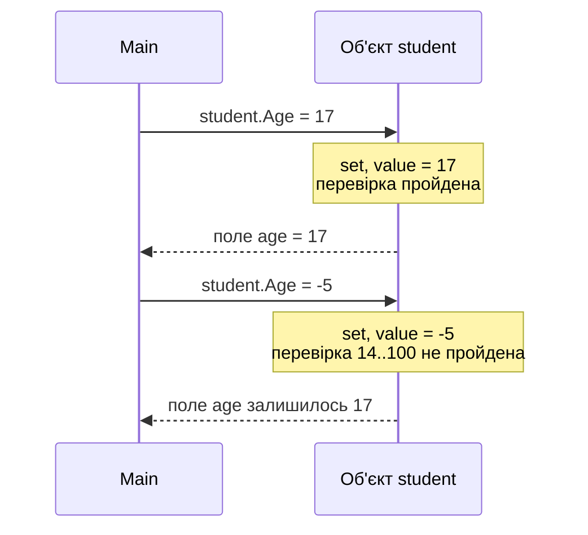
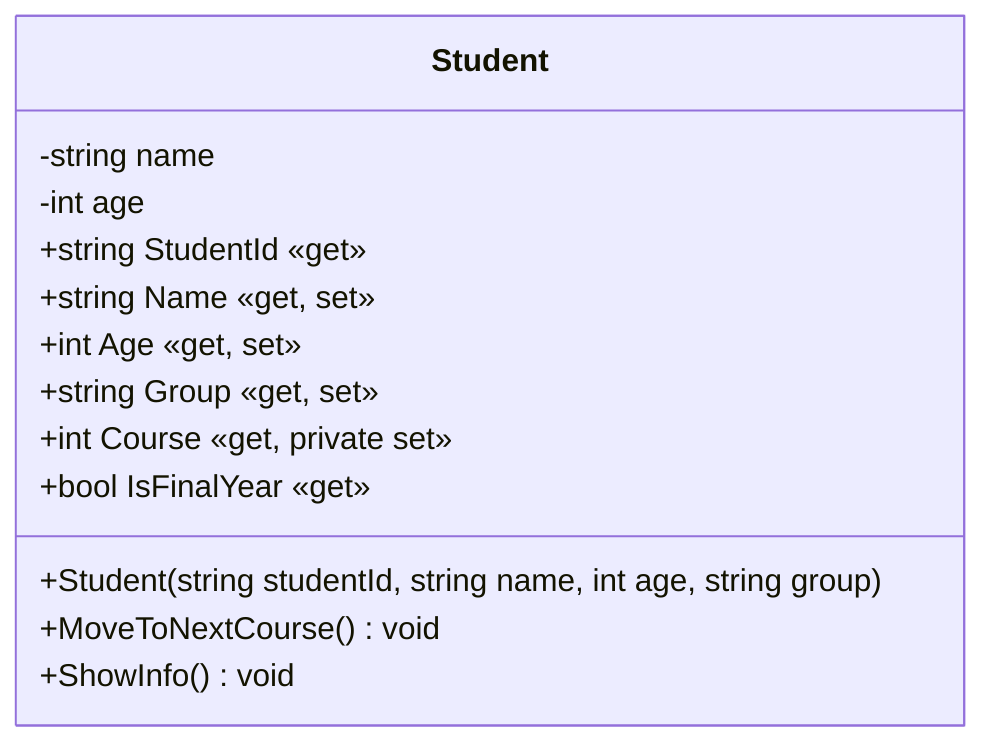

# 2. Інкапсуляція: модифікатори доступу та властивості

![block-badge] ![lang-badge]

## Зміст
1. [Проблема відкритих полів](#проблема-відкритих-полів)
2. [Що таке інкапсуляція](#що-таке-інкапсуляція)
3. [Модифікатори доступу](#модифікатори-доступу)
4. [Приватне поле і методи доступу](#приватне-поле-і-методи-доступу)
5. [Властивості](#властивості)
6. [Автовластивості](#автовластивості)
7. [Обмеження доступу до властивостей](#обмеження-доступу-до-властивостей)
8. [Властивості в конструкторі](#властивості-в-конструкторі)
9. [Повний приклад](#повний-приклад)
10. [Порівняння поля та властивості](#порівняння-поля-та-властивості)
11. [Властивості, якими ви вже користувались](#властивості-якими-ви-вже-користувались)
12. [Підсумок](#підсумок)
13. [Запитання для самоперевірки](#запитання-для-самоперевірки)
14. [Довідкові матеріали](#довідкові-матеріали)

---

## Проблема відкритих полів

У минулому уроці всі поля класу ми робили `public`. Це зручно, але небезпечно. Подивімося на клас студента:

```C#
class Student
{
    public string Name;
    public int Age;
    public int Course;

    public Student(string name, int age, int course)
    {
        Name = name;
        Age = age;
        Course = course;
    }

    public void ShowInfo()
    {
        Console.WriteLine($"{Name}, {Age} р., {Course} курс");
    }
}

class Program
{
    static void Main(string[] args)
    {
        Student student = new Student("Олена", 17, 2);
        student.ShowInfo();

        student.Age = -5;
        student.Course = 40;
        student.Name = "";
        student.ShowInfo();
    }
}
```

Результат роботи:

```text
Олена, 17 р., 2 курс
, -5 р., 40 курс
```

Студентка без імені, віком мінус п'ять років, на сороковому курсі. Компілятор не заперечував: поля відкриті, тож **будь-який код може записати в них будь-що**. Клас ніяк не може захистити свої дані.

У маленькій програмі таку помилку легко помітити. У великому проєкті, де з класом `Student` працюють десятки інших класів, знайти, хто саме записав `-5`, — справжнє детективне розслідування.

---

## Що таке інкапсуляція

> **Інкапсуляція** (encapsulation) — це принцип ООП, за яким об'єкт _приховує свої внутрішні дані_ і дозволяє працювати з ними лише через _контрольовані точки доступу_.

Аналогія — банкомат. Гроші лежать усередині, у сейфі, і ніхто не може просто забрати їх руками. Зате є «публічні» кнопки: вставити картку, ввести PIN, обрати суму. Банкомат сам перевіряє, чи правильний PIN і чи вистачає коштів, і тільки після цього видає гроші.

Так само і клас: поля — це «сейф», а публічні методи та властивості — «кнопки», через які до даних можна дістатися лише за правилами класу.

**Навіщо потрібна інкапсуляція:**

- захист даних від некоректних значень (`Age = -5`)
- перевірка всіх змін в одному місці — всередині класу
- приховування деталей реалізації: внутрішню будову класу можна змінити, не ламаючи код, який ним користується
- простіший інтерфейс: зовнішній код бачить лише те, що йому справді потрібно

> [!NOTE]
> **Зверніть увагу:** інкапсуляція — один з основних принципів ООП, поряд із _наслідуванням_ і _поліморфізмом_. Про них поговоримо в наступних темах.

---

## Модифікатори доступу

> **Модифікатор доступу** (access modifier) — ключове слово перед полем, методом чи класом, яке визначає, _звідки до нього можна звертатися_.

Модифікатори ставлять перед **членами класу** — так називають усе, що оголошено всередині класу: поля, методи, властивості та конструктори.

| Модифікатор | Звідки доступний | Коли використовувати |
| :---- | :---- | :---- |
| **`public`** | Звідусіль | Методи й властивості, які мають бути доступні ззовні |
| **`private`** | Лише всередині цього класу | Поля та допоміжні методи |
| **`protected`** | Усередині класу та його класів-нащадків | Знадобиться, коли вивчатимемо наслідування |

### Що буде, якщо звернутися до приватного члена класу

```C#
class Student
{
    public string Name;
    private int age;
    int course; // модифікатор не вказано

    public Student(string name, int age, int course)
    {
        Name = name;
        this.age = age;
        this.course = course;
    }
}

class Program
{
    static void Main(string[] args)
    {
        Student student = new Student("Олена", 17, 2);
        student.Name = "Ольга"; // OK: поле публічне
        student.age = -5;       // помилка компіляції
        student.course = 40;    // помилка компіляції
    }
}
```

Помилки компіляції:

```text
error CS0122: 'Student.age' is inaccessible due to its protection level
error CS0122: 'Student.course' is inaccessible due to its protection level
```

Компілятор не дає навіть зібрати програму: «поле `age` недоступне через свій рівень захисту». Тепер записати `-5` ззовні неможливо.

Зверніть увагу на поле `course`: модифікатор не вказаний, але поле все одно **приватне**. Це правило **доступу за замовчуванням**:

| Що оголошено | Доступ за замовчуванням |
| :---- | :---- |
| **Поле, метод, властивість, конструктор** усередині класу | `private` |
| **Клас** | `internal` — доступний у межах свого проєкту |

> [!WARNING]
> **Часта помилка:** забути `public` перед конструктором. Такий конструктор стає приватним, і створити об'єкт у `Main` не вийде: `error CS0122: 'Student.Student(string, int, int)' is inaccessible due to its protection level`.

> [!TIP]
> **Порада:** навіть якщо член класу має бути приватним, пишіть `private` явно. Так код читається однозначно, і нікому не доведеться пам'ятати правила за замовчуванням.

### Іменування

За домовленістю C#:

- **приватні поля** — з маленької літери (camelCase): `age`, `course`. У документації Microsoft ви також побачите запис із підкресленням — `_age`; це теж поширений стиль
- **публічні члени** — з великої (PascalCase): `Name`, `ShowInfo()`

> [!NOTE]
> **Зверніть увагу:** у конструкторі вище параметр `age` і поле `age` мають однакові імена. Щоб відрізнити їх, використовуємо `this`: запис `this.age = age;` означає «полю `age` **цього об'єкта** присвоїти значення параметра `age`».

---

## Приватне поле і методи доступу

Ми закрили поле — тепер ніхто не запише `-5`. Але й нормальне значення теж ніхто не прочитає й не змінить. Заборона без альтернативи — це не захист, а глухий кут.

Перше рішення, яке спадає на думку, — додати два публічні методи: один повертає значення, другий перевіряє і змінює його.

```C#
class Student
{
    private int age;

    public int GetAge()
    {
        return age;
    }

    public void SetAge(int value)
    {
        if (value < 14 || value > 100)
        {
            Console.WriteLine($"Помилка: вік {value} неприпустимий");
            return;
        }
        age = value;
    }
}
```

```C#
Student student = new Student();
student.SetAge(17);
student.SetAge(-5);
Console.WriteLine(student.GetAge());
```

Результат роботи:

```text
Помилка: вік -5 неприпустимий
17
```

Це працює: некоректне значення відхилено, коректне — збережено. Так пишуть, наприклад, у Java. Але такий виклик, як `student.SetAge(student.GetAge() + 1)`, виглядає громіздко. У C# для цього є спеціальний, значно зручніший інструмент — **властивості**.

---

## Властивості

> **Властивість** (property) — це член класу, який _зовні виглядає як поле_, а _всередині працює як пара методів_: `get` (читання) і `set` (запис).

```C#
class Student
{
    private int age; // приватне поле, де зберігається значення

    public int Age   // публічна властивість для доступу до нього
    {
        get
        {
            return age;
        }
        set
        {
            if (value < 14 || value > 100)
            {
                Console.WriteLine($"Помилка: вік {value} неприпустимий");
                return;
            }
            age = value;
        }
    }
}
```

| Частина | Що робить |
| :---- | :---- |
| **`private int age`** | Поле, у якому насправді зберігаються дані (його ще називають _резервним полем_ — backing field) |
| **`public int Age`** | Властивість: ім'я в PascalCase, тип збігається з типом поля |
| **`get { ... }`** | Блок, що виконується під час **читання** `student.Age`; повертає значення через `return` |
| **`set { ... }`** | Блок, що виконується під час **запису** `student.Age = ...` |
| **`value`** | Неявний параметр блоку `set`: значення, яке намагаються записати |

Тепер працюємо з властивістю так само просто, як із полем, але кожен запис проходить перевірку:

```C#
Student student = new Student();

student.Age = 17;               // викликається set, value = 17
Console.WriteLine(student.Age); // викликається get

student.Age = -5;               // set відхилить значення
Console.WriteLine(student.Age);

student.Age = student.Age + 1;  // спочатку get, потім set
Console.WriteLine(student.Age);
```

Результат роботи:

```text
17
Помилка: вік -5 неприпустимий
17
18
```

Що відбувається під час запису у властивість:



Зовнішній код навіть не знає, що всередині є перевірка, — він просто пише `student.Age = ...`. Усі правила класу зосереджені в одному місці — у блоці `set`.

> [!NOTE]
> **Зверніть увагу:** якщо значення некоректне, наш `set` виводить повідомлення й залишає старе значення. У реальних проєктах у такому випадку зазвичай **генерують виняток** (exception), щоб помилку неможливо було проігнорувати. Винятки ми розглянемо в окремій темі.

> [!WARNING]
> **Часта помилка:** звернутися до властивості замість поля всередині самої властивості:
> ```C#
> public int Age
> {
>     get { return Age; }  // помилка: Age викликає сам себе!
>     set { Age = value; } // і тут те саме
> }
> ```
> `get` властивості `Age` викликає `get` властивості `Age`, той — знову себе, і так нескінченно, доки програма не впаде з повідомленням `Stack overflow.` (переповнення стека). Компілятор про таку помилку **не попереджає**. Усередині властивості працюйте з **полем** `age` (маленька літера).

---

## Автовластивості

Часто ніяких перевірок не потрібно: властивість просто зберігає і повертає значення. Писати для цього поле й два блоки — зайва робота. Тому в C# є скорочений запис:

```C#
public string Group { get; set; }
```

> **Автовластивість** (auto-implemented property) — властивість, для якої _компілятор сам створює приховане резервне поле_ і найпростіші `get` та `set`.

Запис вище еквівалентний ось такому коду:

```C#
private string group;

public string Group
{
    get { return group; }
    set { group = value; }
}
```

> [!TIP]
> **Порада:** навіщо автовластивість, якщо можна написати `public string Group;`? Якщо пізніше знадобиться перевірка, автовластивість легко перетворити на повну — і жоден рядок коду, що використовує `student.Group`, не доведеться змінювати. Тому в C# публічні дані прийнято оформлювати як властивості, а не як публічні поля.

---

## Обмеження доступу до властивостей

Не всі дані можна змінювати ззовні. Номер студентського квитка взагалі не повинен змінюватися. Курс змінюється, але лише за правилами (переведення на наступний курс), а не довільним присвоєнням. Для таких випадків доступ до `get` і `set` можна обмежити.

### private set

```C#
public int Course { get; private set; }
```

Читати `Course` може будь-хто, а змінювати — **лише код усередині класу**. Отже, змінити курс можна тільки через метод, який перевірить правила:

```C#
public void MoveToNextCourse()
{
    if (Course == 4)
    {
        Console.WriteLine($"{Name} вже навчається на останньому курсі");
        return;
    }
    Course++; // спочатку get, потім set — усередині класу це дозволено
}
```

### Властивість лише для читання

```C#
public string StudentId { get; }
```

Блоку `set` немає взагалі. Таку властивість можна заповнити **тільки в конструкторі** (або одразу під час оголошення), після цього вона назавжди залишиться незмінною.

### Обчислювана властивість

Властивість не обов'язково пов'язана з полем. Її значення можна **обчислювати** щоразу заново з інших даних:

```C#
public bool IsFinalYear
{
    get { return Course == 4; }
}
```

Значення `IsFinalYear` ніде не зберігається: щоразу під час читання воно обчислюється з поточного курсу. Тому воно ніколи не суперечитиме значенню `Course`.

### Що буде, якщо спробувати змінити

```C#
student.Course = 3;          // помилка компіляції
student.StudentId = "КВ-99"; // помилка компіляції
```

Помилки компіляції:

```text
error CS0272: The property or indexer 'Student.Course' cannot be used in this context because the set accessor is inaccessible
error CS0200: Property or indexer 'Student.StudentId' cannot be assigned to -- it is read only
```

### Усі варіанти властивостей

| Варіант | Запис | Читання ззовні | Запис ззовні | Коли використовувати |
| :---- | :---- | :---- | :---- | :---- |
| **Повна з перевіркою** | `get { ... } set { ... }` | ✅ | ✅ з перевіркою | Значення має обмеження |
| **Автовластивість** | `{ get; set; }` | ✅ | ✅ | Будь-яке значення допустиме |
| **З private set** | `{ get; private set; }` | ✅ | ❌ | Змінюється лише методами класу |
| **Лише для читання** | `{ get; }` | ✅ | ❌ | Задається один раз у конструкторі |
| **Обчислювана** | `get { return ...; }` | ✅ | ❌ | Обчислюється з інших даних |

---

## Властивості в конструкторі

Конструктор теж записує значення в об'єкт. І якщо він записує їх **напряму в поле**, перевірку у властивості буде обійдено:

```C#
class Student
{
    private string name;
    private int age;

    public Student(string name, int age)
    {
        this.name = name;
        this.age = age; // напряму в поле — перевірку обійдено!
    }

    public int Age
    {
        get { return age; }
        set
        {
            if (value < 14 || value > 100)
            {
                Console.WriteLine($"Помилка: вік {value} неприпустимий");
                return;
            }
            age = value;
        }
    }

    public void ShowInfo()
    {
        Console.WriteLine($"{name}, {Age} р.");
    }
}
```

```C#
Student student = new Student("Олена", -5);
student.ShowInfo();
```

Результат роботи:

```text
Олена, -5 р.
```

Ми старанно захистили властивість, а некоректний об'єкт усе одно створили — через конструктор. Виправлення — **у конструкторі присвоювати значення властивості, а не полю**:

```C#
public Student(string name, int age)
{
    this.name = name;
    Age = age; // через властивість — перевірка спрацює
}
```

Результат роботи:

```text
Помилка: вік -5 неприпустимий
Олена, 0 р.
```

Тепер некоректне значення не потрапило в об'єкт. Вік залишився `0` — значенням за замовчуванням, бо нормального значення ми так і не отримали. Повністю заборонити створення такого об'єкта можна за допомогою винятків — про них, як уже згадувалось, пізніше.

> [!IMPORTANT]
> **Ключова ідея:** якщо властивість має перевірку, **усі** записи значення — і ззовні, і в конструкторі — мають проходити через неї. Перевірка, яку можна обійти, нічого не захищає.

---

## Повний приклад

Зберемо всі види властивостей в одному класі.

```C#
class Student
{
    // Приватні поля для властивостей з перевіркою
    private string name = "";
    private int age;

    public Student(string studentId, string name, int age, string group)
    {
        StudentId = studentId;
        Name = name; // через властивості — щоб спрацювала перевірка
        Age = age;
        Group = group;
        Course = 1;
    }

    // Лише для читання: значення задається один раз — у конструкторі
    public string StudentId { get; }

    // Повна властивість з перевіркою
    public string Name
    {
        get { return name; }
        set
        {
            // true, якщо рядок null, порожній або складається лише з пробілів
            if (string.IsNullOrWhiteSpace(value))
            {
                Console.WriteLine("Помилка: ім'я не може бути порожнім");
                return;
            }
            name = value;
        }
    }

    // Повна властивість з перевіркою
    public int Age
    {
        get { return age; }
        set
        {
            if (value < 14 || value > 100)
            {
                Console.WriteLine($"Помилка: вік {value} неприпустимий");
                return;
            }
            age = value;
        }
    }

    // Автовластивість: перевірка не потрібна
    public string Group { get; set; }

    // Читати можуть усі, змінювати — лише методи цього класу
    public int Course { get; private set; }

    // Обчислювана властивість: значення не зберігається, а обчислюється
    public bool IsFinalYear
    {
        get { return Course == 4; }
    }

    public void MoveToNextCourse()
    {
        if (IsFinalYear)
        {
            Console.WriteLine($"{Name} вже навчається на останньому курсі");
            return;
        }
        Course++;
    }

    public void ShowInfo()
    {
        Console.WriteLine($"[{StudentId}] {Name}, {Age} р., група {Group}, {Course} курс");
    }
}

class Program
{
    static void Main(string[] args)
    {
        Student student = new Student("КВ-1024", "Олена", 16, "П-11");
        student.ShowInfo();
        Console.WriteLine();

        student.Age = -5;       // перевірка не пропустить
        student.Name = "";      // і це теж
        student.Group = "П-12"; // автовластивість — значення просто записується
        student.ShowInfo();
        Console.WriteLine();

        student.MoveToNextCourse();
        student.MoveToNextCourse();
        student.MoveToNextCourse();
        if (student.IsFinalYear)
        {
            Console.WriteLine($"{student.Name} навчається на випускному курсі");
        }
        student.MoveToNextCourse();
        student.ShowInfo();
    }
}
```

Результат роботи:

```text
[КВ-1024] Олена, 16 р., група П-11, 1 курс

Помилка: вік -5 неприпустимий
Помилка: ім'я не може бути порожнім
[КВ-1024] Олена, 16 р., група П-12, 1 курс

Олена навчається на випускному курсі
Олена вже навчається на останньому курсі
[КВ-1024] Олена, 16 р., група П-12, 4 курс
```

> [!NOTE]
> **Зверніть увагу:** поле `name` одразу отримує початкове значення `""` (порожній рядок). Компілятор не «бачить», що конструктор заповнює поле через властивість `Name`, і без цього показав би попередження `CS8618` про можливий `null`. І це не лише заспокоєння компілятора: якщо в конструктор передати порожнє ім'я, `set` відхилить його, і без `= ""` поле залишилося б `null`.

> [!IMPORTANT]
> **Ключова ідея:** дані класу зберігаються в приватних полях, а назовні відкриваються лише властивості з тим рівнем доступу, який справді потрібен.

### Властивості класу Student

| Властивість | Тип | Доступ | Опис |
| :---- | :---- | :---- | :---- |
| `StudentId` | ![string-badge] | `get` | Номер студентського квитка, задається лише в конструкторі |
| `Name` | ![string-badge] | `get` `set` | Ім'я; порожнє значення не приймається |
| `Age` | ![int-badge] | `get` `set` | Вік; допустимі значення — від 14 до 100 |
| `Group` | ![string-badge] | `get` `set` | Група, автовластивість |
| `Course` | ![int-badge] | `get` `private set` | Курс; змінюється лише через `MoveToNextCourse()` |
| `IsFinalYear` | ![bool-badge] | `get` | Чи навчається студент на 4 курсі (обчислювана властивість) |

### Методи класу Student

| Метод | Параметри | Повертає | Опис |
| :---- | :---- | :---- | :---- |
| `MoveToNextCourse` | — | ![void-badge] | Переведення на наступний курс, якщо курс не останній |
| `ShowInfo` | — | ![void-badge] | Виведення інформації про студента |

### Діаграма класу



Знак `-` означає `private`, `+` — `public`. Приватні поля показано на діаграмі для повноти, але зовнішній код бачить і використовує лише члени зі знаком `+`.

---

## Порівняння поля та властивості

| Критерій | Поле | Властивість |
| :---- | :---- | :---- |
| **Що це** | Змінна всередині об'єкта | Пара методів `get`/`set`, що виглядає як змінна |
| **Зберігає дані** | Так | Ні — дані лежать у полі (для автовластивості — у прихованому) |
| **Перевірка значень** | Неможлива | Так, у блоці `set` |
| **Окремий доступ на читання і запис** | Ні | Так (`private set`, лише `get`) |
| **Типовий модифікатор** | `private` | `public` |
| **Іменування** | camelCase: `age` | PascalCase: `Age` |

**Головна різниця** — поле просто зберігає дані, а властивість **контролює доступ** до них. Тому дані класу зберігають у приватних полях, а назовні відкривають лише властивості з потрібними правилами.

---

## Властивості, якими ви вже користувались

Ви вже працювали з властивостями класів .NET, навіть не знаючи цього:

| Властивість | Приклад | Доступ |
| :---- | :---- | :---- |
| **[String.Length](https://learn.microsoft.com/dotnet/api/system.string.length)** | `name.Length` | Лише читання: змінити довжину рядка присвоєнням неможливо |
| **[List\<T\>.Count](https://learn.microsoft.com/dotnet/api/system.collections.generic.list-1.count)** | `numbers.Count` | Лише читання: кількість змінюється тільки через `Add`, `Remove` тощо — як наш `Course` |
| **[Console.ForegroundColor](https://learn.microsoft.com/dotnet/api/system.console.foregroundcolor)** | `Console.ForegroundColor = ConsoleColor.Green;` | Читання і запис: колір тексту в консолі |

Саме тому в записі `numbers.Count` немає дужок — це не метод, а властивість. А спроба написати `numbers.Count = 10;` дасть ту саму помилку, що й `student.StudentId = "КВ-99";`.

---

## Підсумок

- **інкапсуляція** — дані об'єкта приховані, а працювати з ними можна лише через контрольовані точки доступу
- `public` — доступно звідусіль, `private` — лише всередині класу; члени класу за замовчуванням `private`
- **властивість** виглядає як поле, але має блоки `get` і `set`, у яких можна перевіряти значення
- **автовластивість** `{ get; set; }`, **`private set`**, властивість **лише для читання** `{ get; }` та **обчислювана** властивість дозволяють точно налаштувати доступ
- конструктор має записувати значення **через властивості**, щоб перевірка спрацьовувала і під час створення об'єкта

---

## Запитання для самоперевірки

1. Яку проблему створюють публічні поля? Наведіть приклад.
2. Що таке інкапсуляція? Поясніть на прикладі будь-якого побутового пристрою.
3. Який доступ матиме поле, якщо модифікатор не вказаний?
4. Чим властивість відрізняється від поля?
5. Що означає ключове слово `value` і де його можна використовувати?
6. Чим автовластивість `{ get; set; }` відрізняється від публічного поля?
7. Яка різниця між `{ get; private set; }` і `{ get; }`? Наведіть приклад даних для кожного варіанта.
8. Чому в конструкторі краще писати `Age = age;`, а не `this.age = age;`?

---

## Довідкові матеріали

- [Інкапсуляція (програмування)](https://uk.wikipedia.org/wiki/%D0%86%D0%BD%D0%BA%D0%B0%D0%BF%D1%81%D1%83%D0%BB%D1%8F%D1%86%D1%96%D1%8F_(%D0%BF%D1%80%D0%BE%D0%B3%D1%80%D0%B0%D0%BC%D1%83%D0%B2%D0%B0%D0%BD%D0%BD%D1%8F)) — `uk.wikipedia.org`
- [Властивість (програмування)](https://uk.wikipedia.org/wiki/%D0%92%D0%BB%D0%B0%D1%81%D1%82%D0%B8%D0%B2%D1%96%D1%81%D1%82%D1%8C_(%D0%BF%D1%80%D0%BE%D0%B3%D1%80%D0%B0%D0%BC%D1%83%D0%B2%D0%B0%D0%BD%D0%BD%D1%8F)) — `uk.wikipedia.org`
- [Access Modifiers](https://learn.microsoft.com/dotnet/csharp/programming-guide/classes-and-structs/access-modifiers) — `learn.microsoft.com`
- [Properties](https://learn.microsoft.com/dotnet/csharp/programming-guide/classes-and-structs/properties) — `learn.microsoft.com`
- [Using Properties](https://learn.microsoft.com/dotnet/csharp/programming-guide/classes-and-structs/using-properties) — `learn.microsoft.com`
- [Automatically Implemented Properties](https://learn.microsoft.com/dotnet/csharp/programming-guide/classes-and-structs/auto-implemented-properties) — `learn.microsoft.com`
- [Identifier names - rules and conventions](https://learn.microsoft.com/dotnet/csharp/fundamentals/coding-style/identifier-names) — `learn.microsoft.com`

---
[block-badge]:https://img.shields.io/badge/%D0%9E%D0%9E%D0%9F-purple?style=flat
[lang-badge]:https://img.shields.io/badge/C%23-blue?style=flat&logo=dotnet
[string-badge]:https://img.shields.io/badge/string-green?style=flat
[int-badge]:https://img.shields.io/badge/int-blue?style=flat
[bool-badge]:https://img.shields.io/badge/bool-orange?style=flat
[void-badge]:https://img.shields.io/badge/void-lightgrey?style=flat
