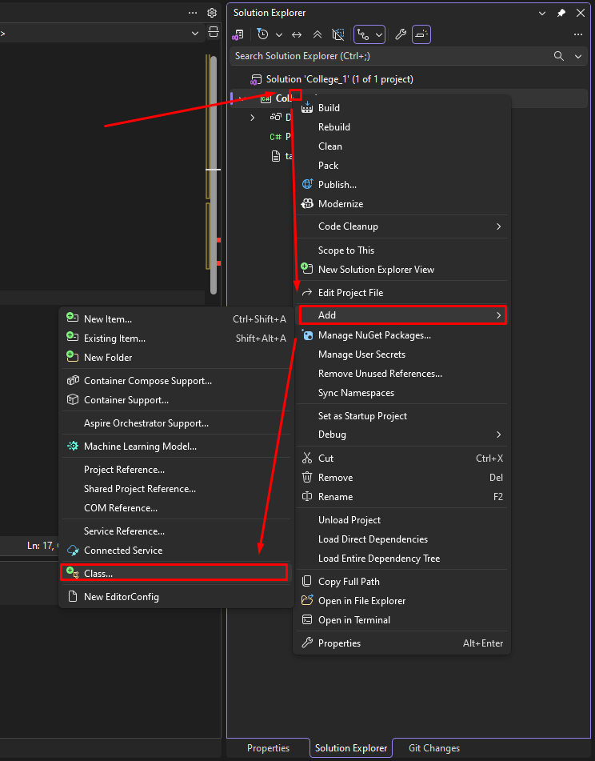
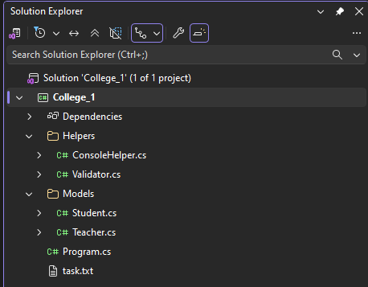
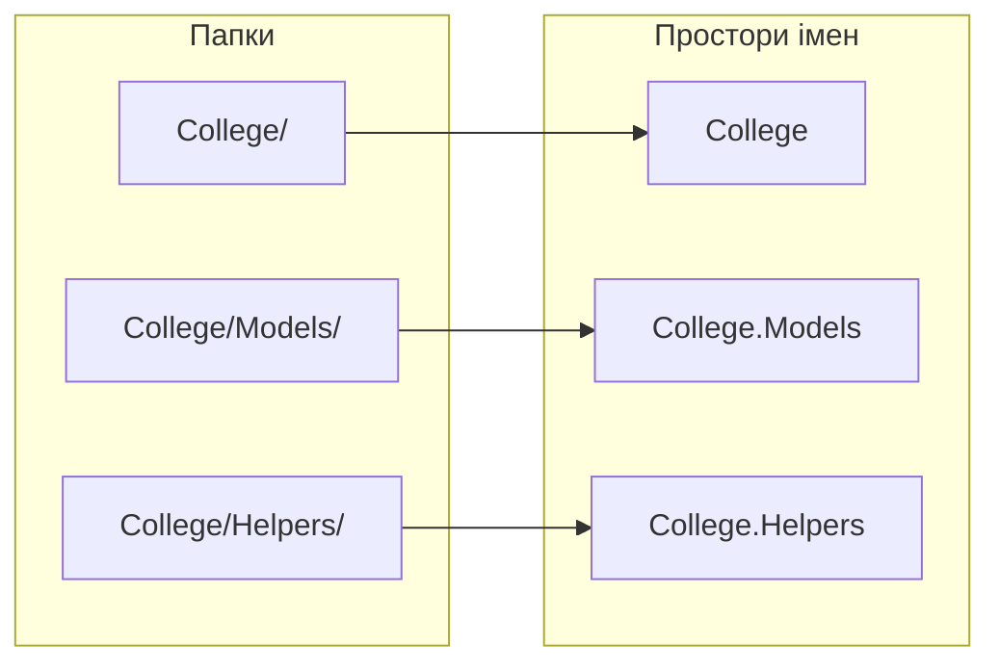
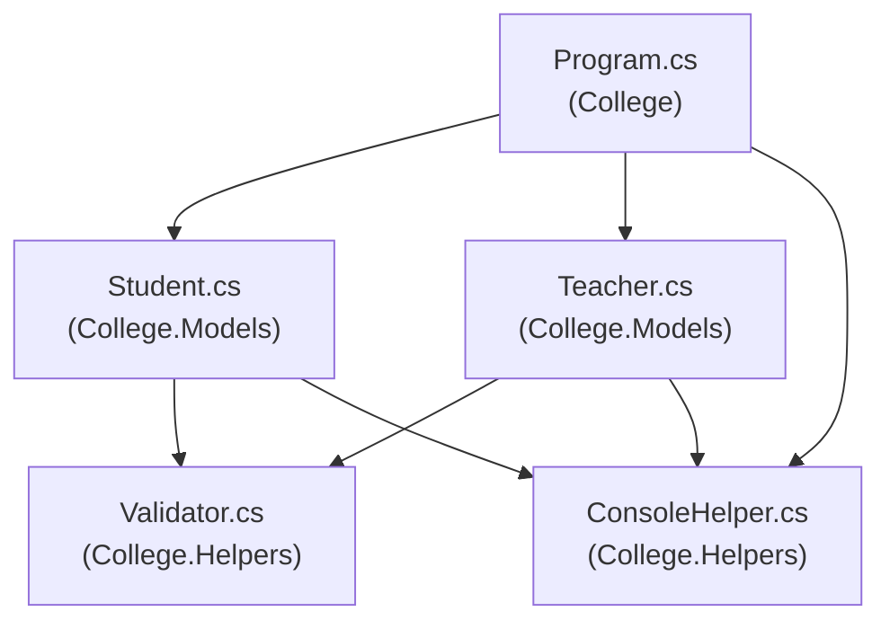

# 3. Організація проєкту: кілька файлів

![block-badge] ![lang-badge]

## Зміст
1. [Проблема одного великого файлу](#проблема-одного-великого-файлу)
2. [Один клас на файл](#один-клас-на-файл)
3. [Папки в проєкті](#папки-в-проєкті)
4. [Простори імен](#простори-імен)
5. [Директива using](#директива-using)
6. [Винесення спільного функціоналу](#винесення-спільного-функціоналу)
7. [Практика: розкладаємо проєкт по файлах](#практика-розкладаємо-проєкт-по-файлах)
8. [Порівняння одного файлу та кількох файлів](#порівняння-одного-файлу-та-кількох-файлів)
9. [Організація реальних проєктів](#організація-реальних-проєктів)
10. [Підсумок](#підсумок)
11. [Запитання для самоперевірки](#запитання-для-самоперевірки)
12. [Довідкові матеріали](#довідкові-матеріали)

---

## Проблема одного великого файлу

У попередніх уроках усі класи ми писали в одному файлі `Program.cs`. Поки класів два-три, це зручно. Але уявімо програму для коледжу, де є студенти, викладачі, групи, розклад, оцінки:

```C#
// Program.cs — 600 рядків

class Student
{
    // 60 рядків: поля, властивості з перевірками, методи...
}

class Teacher
{
    // ще 60 рядків — і перевірки імені та віку майже такі самі, як у Student
}

class Group { /* ... */ }
class Schedule { /* ... */ }
class Grade { /* ... */ }

class Program
{
    static void Main(string[] args)
    {
        // ...
    }
}
```

**Що з цим не так:**

- щоб знайти потрібний клас, доводиться гортати сотні рядків
- неможливо одним поглядом оцінити, з яких частин складається програма
- коли двоє людей одночасно редагують один файл, їхні зміни конфліктують
- однаковий код (перевірки імені та віку) скопійований у кілька класів — виправили помилку в одному місці, забули в іншому

Рішення — розкласти код по файлах і папках так само, як ви розкладаєте документи по папках на комп'ютері.

---

## Один клас на файл

> **Правило «один клас — один файл»**: кожен клас зберігається в _окремому файлі_, назва якого _збігається з назвою класу_.

| Клас | Файл |
| :---- | :---- |
| **`Student`** | `Student.cs` |
| **`Teacher`** | `Teacher.cs` |
| **`ConsoleHelper`** | `ConsoleHelper.cs` |

Компілятору байдуже, як називаються файли: він збирає всі `.cs`-файли проєкту в одну програму. Правило існує для людей — щоб клас `Teacher` можна було знайти, не відкриваючи жодного файлу.

### Як додати клас у Visual Studio

1. У вікні **Solution Explorer** клацніть правою кнопкою миші на проєкті (або на папці всередині нього)
2. Оберіть **Add → Class...** (або натисніть `Shift + Alt + C`)
3. Введіть ім'я класу, наприклад `Student` (розширення `.cs` Visual Studio додасть сама), і натисніть **Add**



Visual Studio створить файл приблизно такого вигляду (залежно від версії зверху можуть бути ще рядки `using ...` — їх можна видалити):

```C#
namespace College.Models
{
    internal class Student
    {
    }
}
```

Слово `namespace` ми розберемо трохи нижче, а `internal` означає «клас доступний у межах цього проєкту» — для наших програм цього достатньо. Клас без модифікатора теж `internal` за замовчуванням (пам'ятаєте таблицю з уроку 2?), тому `class Program` і `internal class Student` мають однаковий доступ.

> [!TIP]
> **Порада:** якщо перейменувати файл у Solution Explorer, Visual Studio запропонує перейменувати і клас усередині нього. Погоджуйтеся — так назви завжди збігатимуться.

> [!NOTE]
> **Зверніть увагу:** у Visual Studio Code з розширенням **C# Dev Kit** клас додається через панель **Solution Explorer**: правою кнопкою на проєкті чи папці → **Add New File** → шаблон **Class**.

---

## Папки в проєкті

Навіть у невеликому проєкті файли зручно групувати в **папки** за призначенням. Папку створюють так само через контекстне меню: **Add → New Folder**.

Для нашої програми коледжу логічна така структура:

```
College/
├── College.csproj
├── Program.cs
├── Models/
│   ├── Student.cs
│   └── Teacher.cs
└── Helpers/
    ├── ConsoleHelper.cs
    └── Validator.cs
```

| Папка | Що в ній лежить |
| :---- | :---- |
| **`Models/`** | Класи, що описують сутності предметної області: студент, викладач, група |
| **`Helpers/`** | Допоміжні класи, якими користуються всі інші: вивід у консоль, перевірки |
| **корінь проєкту** | `Program.cs` з точкою входу `Main` і файл проєкту `.csproj` |

Назви папок — англійською, у PascalCase, зазвичай у множині: `Models`, `Helpers`, `Services`.



---

## Простори імен

Уявіть, що в коледжі навчаються два Олександри Коваленки: один у групі П-11, другий — у П-21. Щоб не плутати їх, кажуть «Коваленко з П-11» і «Коваленко з П-21». Група тут працює як «адреса», що робить ім'я унікальним.

> **Простір імен** (namespace; в українських джерелах також «простір назв») — це _іменована область_, яка групує пов'язані класи та робить їхні імена унікальними: два класи з однаковою назвою можуть існувати в різних просторах імен.

```C#
namespace College.Models
{
    internal class Student
    {
        // ...
    }
}
```

Тепер **повне ім'я** класу — `College.Models.Student`. Крапки утворюють ієрархію: простір `Models` вкладений у простір `College`.

### Простори імен і папки

Простори імен **не зобов'язані** збігатися з папками, але так прийнято. Visual Studio під час створення класу сама формує простір імен із назви проєкту та шляху до папки:



На схемі: кожній папці відповідає простір імен із тим самим шляхом, тільки замість `/` — крапка.

### Два способи запису

| Спосіб | Запис | Особливість |
| :---- | :---- | :---- |
| **Блоковий** | `namespace College.Models { ... }` | Клас пишеться всередині фігурних дужок — зайвий рівень відступу |
| **На весь файл** (file-scoped) | `namespace College.Models;` | Діє на весь файл, без дужок і без зайвого відступу |

```C#
namespace College.Models;

internal class Student
{
    // ...
}
```

Обидва записи працюють однаково. Далі в уроках використовуємо **запис на весь файл** — він коротший. Якщо Visual Studio згенерувала блоковий варіант, можна залишити його або змінити: поставте курсор на `namespace`, натисніть `Ctrl + .` і оберіть **Convert to file-scoped namespace**.

> [!IMPORTANT]
> **Ключова ідея:** простір імен для класу — те саме, що адреса для людини: ім'я може повторюватися, а повне ім'я разом з адресою — ні.

---

## Директива using

Класи `Student` і `Teacher` тепер у просторі `College.Models`, а `Program` — у просторі `College`. Спробуємо створити студента в `Main`:

```C#
namespace College;

class Program
{
    static void Main(string[] args)
    {
        Student student = new Student("Олена", 17, "П-21");
    }
}
```

Помилка компіляції:

```text
error CS0246: The type or namespace name 'Student' could not be found (are you missing a using directive or an assembly reference?)
```

Компілятор шукає клас `Student` у просторі `College` і не знаходить. Він навіть підказує: «можливо, ви пропустили директиву using?»

> **Директива `using`** — рядок на початку файлу, який _підключає простір імен_: після нього класи з цього простору можна використовувати за коротким ім'ям.

```C#
using College.Models;

namespace College;

class Program
{
    static void Main(string[] args)
    {
        Student student = new Student("Олена", 17, "П-21"); // тепер працює
    }
}
```

Без `using` теж можна обійтися — якщо писати **повне ім'я** класу:

```C#
College.Models.Student student = new College.Models.Student("Олена", 17, "П-21");
```

Але так код швидко стає важким для читання, тому на практиці майже завжди використовують `using`.

> [!TIP]
> **Порада:** не обов'язково пам'ятати, у якому просторі імен лежить клас. Коли Visual Studio підкреслює невідомий клас червоним, поставте на нього курсор і натисніть `Ctrl + .` — середовище запропонує додати потрібний `using` автоматично.

### Неявні using

Чому `Console.WriteLine` працює без `using System;`, хоча клас `Console` лежить у просторі імен `System`? У нових проєктах .NET увімкнені **неявні using** (implicit usings): найпопулярніші простори імен — `System`, `System.Collections.Generic`, `System.IO`, `System.Linq` та інші — підключаються до кожного файлу автоматично.

> [!WARNING]
> **Часта помилка:** назвати свій клас так само, як вбудований клас .NET. Наприклад, у `College.Models` створили клас `Task` (завдання для студентів). У `Program.cs`, де є `using College.Models;`, отримаємо:
>
> ```text
> error CS0104: 'Task' is an ambiguous reference between 'College.Models.Task' and 'System.Threading.Tasks.Task'
> ```
>
> Компілятор бачить два класи `Task`: ваш і вбудований — з простору імен `System.Threading.Tasks`, який підключено неявно. Він не може вгадати, який із них ви мали на увазі. Найпростіше рішення — дати класу точнішу назву (`TaskItem`, `StudentTask`) або писати повне ім'я: `College.Models.Task`.

---

## Винесення спільного функціоналу

Подивимося на властивості `Name` і `Age` в класах `Student` і `Teacher`. Перевірки в них майже однакові: ім'я не може бути порожнім, вік має бути в певних межах. Відрізняються лише межі віку: студенту — від 14, викладачу — від 18.

Скопійований код — це міна сповільненої дії: якщо змінити правило перевірки імені, доведеться пам'ятати всі місця, куди його скопіювали.

> **Принцип DRY** (Don't Repeat Yourself — «не повторюйся»): _кожна частина логіки програми повинна бути описана в одному місці_.

Тому спільну логіку виносять в окремі допоміжні класи:

```C#
namespace College.Helpers;

internal static class Validator
{
    public static bool IsValidName(string name)
    {
        return !string.IsNullOrWhiteSpace(name);
    }

    public static bool IsInRange(int value, int min, int max)
    {
        return value >= min && value <= max;
    }
}
```

Тепер обидва класи викликають ту саму перевірку, а правило описане рівно один раз:

```C#
if (!Validator.IsValidName(value))
{
    // ім'я некоректне...
}
```

Самі властивості `Name` і `Age` у двох класах усе ще схожі. Як позбутися і цього повторення, дізнаємося, коли вивчатимемо наслідування.

### Що означає static

У класі `Validator` ви бачите нове слово — `static`. **Статичні** методи належать класу в цілому, а не окремому об'єкту. Тому їх викликають **через ім'я класу**, без створення об'єкта через `new`:

```C#
Validator.IsValidName("Олена"); // статичний метод: об'єкт не потрібен
student.ShowInfo();             // звичайний метод: потрібен конкретний об'єкт
```

Ви вже давно так робите: `Console.WriteLine(...)` і `Math.Max(...)` — це виклики статичних методів класів `Console` і `Math`. І самі ви вже писали статичні методи: `Main`, а в уроці 1 — `UsePhone` і `ShowPhone` у класі `Program`. Статичний клас (`static class`) може містити лише статичні члени, і створити його об'єкт неможливо.

Статичні класи ідеально підходять для допоміжного функціоналу, який **не має власного стану**: перевірити значення, вивести гарний заголовок, порахувати щось за формулою. Детально про `static` поговоримо в окремій темі.

> [!WARNING]
> **Часта помилка:** зробити класи-«звалища» на кшталт `Utils` чи `Helper`, куди складають усе підряд. Кожен допоміжний клас має відповідати за одну річ: `Validator` — перевірки, `ConsoleHelper` — вивід у консоль.

---

## Практика: розкладаємо проєкт по файлах

Візьмемо програму для коледжу, у якій усі класи лежать в одному `Program.cs`, і наведемо в ній лад. Щоб не відволікатися, клас `Student` з уроку 2 ми спростили (без `StudentId` і `Course`) і додали клас `Teacher` з такими самими перевірками імені та віку. Якщо переносите свій `Student` з уроку 2, переносьте його повністю — принцип той самий.

**План дій:**

1. Створюємо папки `Models` і `Helpers` → **Add → New Folder**
2. У папці `Helpers` створюємо класи `Validator` і `ConsoleHelper` → переносимо в них спільну логіку
3. У папці `Models` створюємо класи `Student` і `Teacher` → **вирізаємо** код класів зі старого `Program.cs` і вставляємо в нові файли
4. Замінюємо скопійовані перевірки на виклики `Validator` → додаємо `using College.Helpers;`
5. У `Program.cs` залишаємо лише клас `Program` з `Main` → додаємо `namespace College;`, `using College.Models;` і `using College.Helpers;`
6. Збираємо проєкт (`Ctrl + Shift + B`) і перевіряємо, що програма працює так само, як до змін

Така зміна структури коду без зміни його поведінки називається **рефакторингом** (refactoring).

> [!WARNING]
> **Часта помилка:** скопіювати клас у новий файл і забути видалити його зі старого `Program.cs`. Помилки не буде: компілятор мовчки використає старий клас, і зміни в новому файлі «не працюватимуть». Тому код класів саме **вирізаємо**, а не копіюємо.

### Структура проєкту

```
College/
├── College.csproj
├── Program.cs
├── Models/
│   ├── Student.cs
│   └── Teacher.cs
└── Helpers/
    ├── ConsoleHelper.cs
    └── Validator.cs
```

#### `Helpers/Validator.cs` — перевірки значень

```C#
namespace College.Helpers;

internal static class Validator
{
    public static bool IsValidName(string name)
    {
        return !string.IsNullOrWhiteSpace(name);
    }

    public static bool IsInRange(int value, int min, int max)
    {
        return value >= min && value <= max;
    }
}
```

#### `Helpers/ConsoleHelper.cs` — оформлення виводу

```C#
namespace College.Helpers;

internal static class ConsoleHelper
{
    public static void PrintTitle(string title)
    {
        Console.WriteLine();
        Console.WriteLine($"===== {title} =====");
    }

    public static void PrintError(string message)
    {
        Console.ForegroundColor = ConsoleColor.Red;
        Console.WriteLine($"Помилка: {message}");
        Console.ResetColor();
    }
}
```

#### `Models/Student.cs` — студент

```C#
using College.Helpers;

namespace College.Models;

internal class Student
{
    private string name = "";
    private int age;

    public Student(string name, int age, string group)
    {
        Name = name;
        Age = age;
        Group = group;
    }

    public string Name
    {
        get { return name; }
        set
        {
            if (!Validator.IsValidName(value))
            {
                ConsoleHelper.PrintError("ім'я не може бути порожнім");
                return;
            }
            name = value;
        }
    }

    public int Age
    {
        get { return age; }
        set
        {
            if (!Validator.IsInRange(value, 14, 100))
            {
                ConsoleHelper.PrintError($"вік студента {value} неприпустимий");
                return;
            }
            age = value;
        }
    }

    public string Group { get; set; }

    public void ShowInfo()
    {
        Console.WriteLine($"Студент: {Name}, {Age} р., група {Group}");
    }
}
```

#### `Models/Teacher.cs` — викладач

```C#
using College.Helpers;

namespace College.Models;

internal class Teacher
{
    private string name = "";
    private int age;

    public Teacher(string name, int age, string subject)
    {
        Name = name;
        Age = age;
        Subject = subject;
    }

    public string Name
    {
        get { return name; }
        set
        {
            if (!Validator.IsValidName(value))
            {
                ConsoleHelper.PrintError("ім'я не може бути порожнім");
                return;
            }
            name = value;
        }
    }

    public int Age
    {
        get { return age; }
        set
        {
            if (!Validator.IsInRange(value, 18, 100))
            {
                ConsoleHelper.PrintError($"вік викладача {value} неприпустимий");
                return;
            }
            age = value;
        }
    }

    public string Subject { get; set; }

    public void ShowInfo()
    {
        Console.WriteLine($"Викладач: {Name}, {Age} р., предмет: {Subject}");
    }
}
```

> [!NOTE]
> **Зверніть увагу:** якщо ваш `Program.cs` не містить класу `Program` і методу `Main` (інструкції верхнього рівня, top-level statements), для багатофайлового проєкту це нічого не змінює: класи з інших файлів підключаються так само через `using`. Лише рядок `namespace College;` у такий `Program.cs` додавати не можна — достатньо самих `using`.

#### `Program.cs` — точка входу

```C#
using College.Helpers;
using College.Models;

namespace College;

class Program
{
    static void Main(string[] args)
    {
        ConsoleHelper.PrintTitle("Студенти");
        Student student1 = new Student("Олена", 17, "П-21");
        Student student2 = new Student("Максим", 16, "П-11");
        student1.ShowInfo();
        student2.ShowInfo();
        student2.Age = 7;

        ConsoleHelper.PrintTitle("Викладачі");
        Teacher teacher = new Teacher("Ірина Петрівна", 42, "Програмування");
        teacher.ShowInfo();
        teacher.Age = 15;
        teacher.Name = " ";
        teacher.ShowInfo();
    }
}
```

Результат роботи:

```text

===== Студенти =====
Студент: Олена, 17 р., група П-21
Студент: Максим, 16 р., група П-11
Помилка: вік студента 7 неприпустимий

===== Викладачі =====
Викладач: Ірина Петрівна, 42 р., предмет: Програмування
Помилка: вік викладача 15 неприпустимий
Помилка: ім'я не може бути порожнім
Викладач: Ірина Петрівна, 42 р., предмет: Програмування
```

Перший рядок виводу порожній — його виводить `PrintTitle`. Рядки з помилками в консолі виводяться червоним кольором.

Хто кого використовує в цьому проєкті:



На схемі: стрілка означає «використовує». Допоміжні класи з `Helpers` нічого не знають про моделі, а моделі не знають про `Program` — залежності йдуть в одному напрямку.

> [!IMPORTANT]
> **Ключова ідея:** поведінка програми не змінилася, але тепер кожен файл короткий і відповідає за одне. Щоб змінити правило перевірки імені, достатньо відредагувати **один** метод у `Validator.cs`.

---

## Порівняння одного файлу та кількох файлів

| Критерій | Усе в одному файлі | Кожен клас у своєму файлі |
| :---- | :---- | :---- |
| **Пошук класу** | Гортати й шукати в тексті | Відкрити файл з потрібною назвою |
| **Огляд структури програми** | Неможливий без читання коду | Видно одразу в Solution Explorer |
| **Командна робота** | Постійні конфлікти змін в одному файлі | Кожен працює зі своїми файлами |
| **Повторне використання** | Клас доводиться копіювати шматком тексту | Файл класу можна перенести в інший проєкт |
| **Коли доречно** | Навчальні приклади на 2–3 класи | Будь-який реальний проєкт |

**Головна різниця** — не для компілятора (він однаково збере всі класи в одну програму), а для людей, які читають і змінюють код. А код читають значно частіше, ніж пишуть.

---

## Організація реальних проєктів

Структура з папками та просторами імен — стандарт для будь-якого проєкту на C#. Ось папки, які часто трапляються в проєктах:

| Папка | Призначення |
| :---- | :---- |
| **`Models`** | Класи даних предметної області |
| **`Services`** | Класи з бізнес-логікою: обробка замовлень, розрахунки, робота з файлами |
| **`Helpers`** / **`Utils`** | Допоміжні класи загального призначення |
| **`Data`** | Робота з базою даних |
| **`Controllers`**, **`Views`** | Веб-застосунки на ASP.NET Core |

Сама бібліотека .NET побудована так само — тисячі класів розкладені по просторах імен:

| Простір імен | Що містить |
| :---- | :---- |
| **[System](https://learn.microsoft.com/dotnet/api/system)** | Базові типи: `Console`, `Math`, `String`, `Random`, `DateTime` |
| **[System.Collections.Generic](https://learn.microsoft.com/dotnet/api/system.collections.generic)** | Колекції: `List<T>`, `Dictionary<TKey, TValue>` |
| **[System.IO](https://learn.microsoft.com/dotnet/api/system.io)** | Робота з файлами та папками: `File`, `Directory` |
| **[System.Text](https://learn.microsoft.com/dotnet/api/system.text)** | Робота з текстом і кодуваннями: `StringBuilder`, `Encoding` |

Пам'ятаєте рядок `Console.OutputEncoding = System.Text.Encoding.UTF8;` з першого уроку? Тепер його можна прочитати повністю: клас `Encoding` з простору імен `System.Text`.

---

## Підсумок

- **один клас — один файл**, назва файлу збігається з назвою класу; файли групуються в папки за призначенням
- **простір імен** (`namespace`) групує класи й робить їхні імена унікальними; зазвичай він відповідає шляху до папки
- **`using`** підключає простір імен, щоб використовувати класи за коротким ім'ям; найпоширеніші простори підключені неявно
- **спільну логіку** виносять в окремі допоміжні класи (принцип DRY); для функціоналу без стану зручні **статичні** класи
- зміна структури коду без зміни поведінки програми називається **рефакторингом**

---

## Запитання для самоперевірки

1. Які проблеми виникають, коли всі класи програми зберігаються в одному файлі?
2. Як має називатися файл із класом `GameCharacter`?
3. Що таке простір імен і навіщо він потрібен?
4. Яке повне ім'я матиме клас `Teacher`, що лежить у папці `Models` проєкту `College`?
5. Що робить директива `using`? Як обійтися без неї?
6. Чому `Console.WriteLine` працює без `using System;`?
7. Що означає принцип DRY? Як він застосований у класі `Validator`?
8. Чим виклик статичного методу відрізняється від виклику звичайного методу?
9. Що станеться, якщо назвати свій клас `Task`? Як це виправити?

---

## Довідкові матеріали

- [Простір назв](https://uk.wikipedia.org/wiki/%D0%9F%D1%80%D0%BE%D1%81%D1%82%D1%96%D1%80_%D0%BD%D0%B0%D0%B7%D0%B2) — `uk.wikipedia.org`
- [Чистий код](https://refactoring.guru/uk/refactoring/what-is-refactoring) — `refactoring.guru`
- [Namespaces and using directives](https://learn.microsoft.com/dotnet/csharp/fundamentals/program-structure/namespaces) — `learn.microsoft.com`
- [The using directive: Import types from a namespace](https://learn.microsoft.com/dotnet/csharp/language-reference/keywords/using-directive) — `learn.microsoft.com`
- [Static Classes and Static Class Members](https://learn.microsoft.com/dotnet/csharp/programming-guide/classes-and-structs/static-classes-and-static-class-members) — `learn.microsoft.com`
- [Learn about Solution Explorer](https://learn.microsoft.com/visualstudio/ide/use-solution-explorer) — `learn.microsoft.com`
- [Top-level statements - programs without Main methods](https://learn.microsoft.com/dotnet/csharp/fundamentals/program-structure/top-level-statements) — `learn.microsoft.com`

---
[block-badge]:https://img.shields.io/badge/%D0%9E%D0%9E%D0%9F-purple?style=flat
[lang-badge]:https://img.shields.io/badge/C%23-blue?style=flat&logo=dotnet
