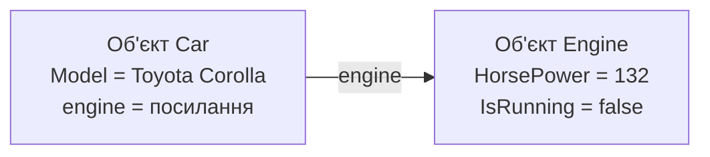
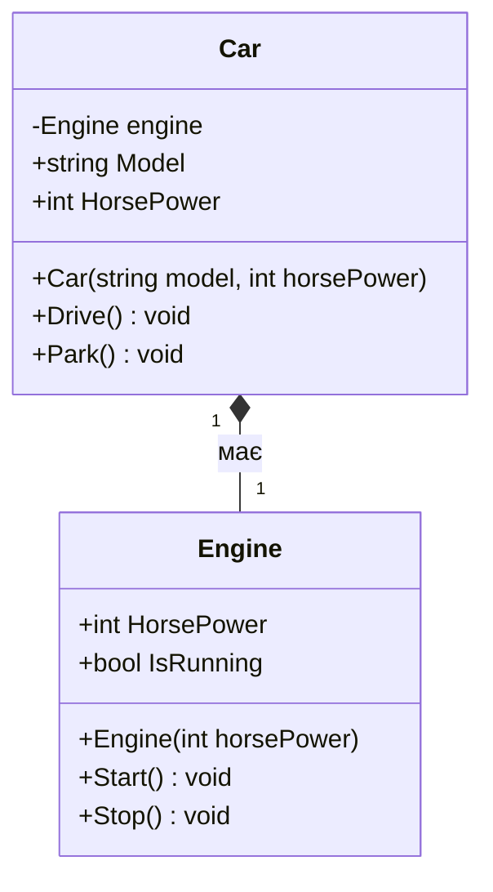
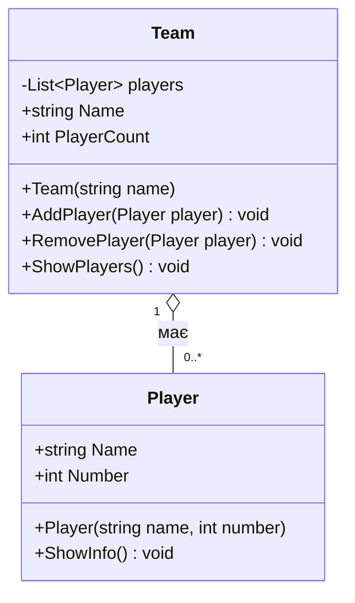
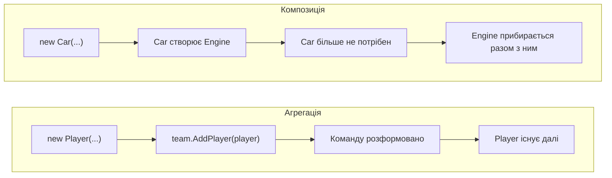
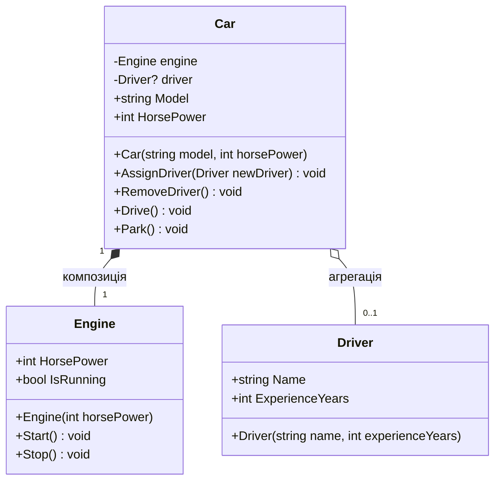

# 4. Зв'язки між об'єктами: агрегація та композиція

![block-badge] ![lang-badge]

## Зміст
1. [Об'єкт як поле іншого об'єкта](#обєкт-як-поле-іншого-обєкта)
2. [Зв'язок «має» (has-a)](#звязок-має-has-a)
3. [Композиція](#композиція)
4. [Агрегація](#агрегація)
5. [Різниця в коді](#різниця-в-коді)
6. [Повний приклад](#повний-приклад)
7. [Порівняння композиції та агрегації](#порівняння-композиції-та-агрегації)
8. [Зв'язки між об'єктами в реальних програмах](#звязки-між-обєктами-в-реальних-програмах)
9. [Підсумок](#підсумок)
10. [Запитання для самоперевірки](#запитання-для-самоперевірки)
11. [Довідкові матеріали](#довідкові-матеріали)

---

## Об'єкт як поле іншого об'єкта

Досі поля наших класів мали вбудовані типи: `int`, `string`, `bool`. Але реальні об'єкти складаються з інших об'єктів. В автомобіля є двигун, у команди — гравці, у замовлення в інтернет-магазині — товари.

Тип поля може бути **будь-яким класом**, зокрема написаним вами:

```C#
internal class Car
{
    private Engine engine; // поле типу Engine — об'єкт іншого класу
    // ...
}
```

Пам'ятаєте з першого уроку, що змінна, тип якої — клас, зберігає не сам об'єкт, а **посилання** на нього? Те саме і з полем: об'єкт `Car` фізично не містить двигуна в собі, а зберігає посилання на окремий об'єкт `Engine`.



На схемі: поле `engine` об'єкта `Car` вказує на окремий об'єкт `Engine` у пам'яті.

> [!NOTE]
> **Зверніть увагу:** код цього уроку одразу організований так, як ви навчилися в уроці 3: кожен клас в окремому файлі, моделі — в папці `Models`.

---

## Зв'язок «має» (has-a)

> **Зв'язок «має»** (has-a) — відношення між класами, за якого _один об'єкт містить інший як свою складову частину або ресурс_.

Перевірити, чи є між класами такий зв'язок, просто — достатньо скласти речення зі словом «має»:

| Речення | Зв'язок «має»? |
| :---- | :---- |
| **Автомобіль має двигун** | ✅ |
| **Команда має гравців** | ✅ |
| **Студент має залікову книжку** | ✅ |
| **Автомобіль має водія** | ✅ |
| **Автомобіль є транспортним засобом** | ❌ — це зв'язок «є» (is-a), про нього поговоримо пізніше |

Але між «автомобіль має двигун» і «автомобіль має водія» є суттєва різниця. Двигун — частина автомобіля: його встановили на заводі, і в нашій програмі він існує лише як частина автомобіля. А водій — окрема людина: вона існувала до автомобіля, вийде з нього і пересяде в інший.

Ця різниця має назви: перший випадок — **композиція**, другий — **агрегація**.

---

## Композиція

> **Композиція** (composition) — зв'язок «ціле — частина», за якого _частина не існує без цілого_: ціле саме створює свої частини, і вони живуть рівно стільки, скільки живе ціле.

Приклад — автомобіль і двигун. Автомобіль **сам створює** свій двигун у конструкторі. Ззовні до двигуна ніхто не має доступу.

### Проєкт

```
Garage/
├── Program.cs
└── Models/
    ├── Car.cs
    └── Engine.cs
```

#### `Models/Engine.cs` — двигун

```C#
namespace Garage.Models;

internal class Engine
{
    public Engine(int horsePower)
    {
        HorsePower = horsePower;
    }

    public int HorsePower { get; }
    public bool IsRunning { get; private set; }

    public void Start()
    {
        IsRunning = true;
        Console.WriteLine($"Двигун {HorsePower} к.с. запущено");
    }

    public void Stop()
    {
        IsRunning = false;
        Console.WriteLine("Двигун зупинено");
    }
}
```

#### `Models/Car.cs` — автомобіль

```C#
namespace Garage.Models;

internal class Car
{
    private Engine engine; // частина автомобіля

    public Car(string model, int horsePower)
    {
        Model = model;
        engine = new Engine(horsePower); // автомобіль сам створює свій двигун
    }

    public string Model { get; }

    public int HorsePower
    {
        get { return engine.HorsePower; }
    }

    public void Drive()
    {
        if (!engine.IsRunning)
        {
            engine.Start();
        }
        Console.WriteLine($"{Model} їде");
    }

    public void Park()
    {
        if (engine.IsRunning)
        {
            engine.Stop();
        }
        Console.WriteLine($"{Model} припарковано");
    }
}
```

#### `Program.cs` — точка входу

```C#
using Garage.Models;

namespace Garage;

class Program
{
    static void Main(string[] args)
    {
        Car toyota = new Car("Toyota Corolla", 132);
        Car ford = new Car("Ford Focus", 125);

        Console.WriteLine($"{toyota.Model}: {toyota.HorsePower} к.с.");
        Console.WriteLine($"{ford.Model}: {ford.HorsePower} к.с.");
        Console.WriteLine();

        toyota.Drive();
        toyota.Park();
    }
}
```

Результат роботи:

```text
Toyota Corolla: 132 к.с.
Ford Focus: 125 к.с.

Двигун 132 к.с. запущено
Toyota Corolla їде
Двигун зупинено
Toyota Corolla припарковано
```

**Ознаки композиції в коді:**

- об'єкт-частина створюється **всередині** цілого: `engine = new Engine(horsePower);`
- поле з частиною **приватне** — ззовні до двигуна не дістатися
- `Main` навіть не знає про існування класу `Engine`: він працює лише з `Car`
- ціле віддає потрібні дані частини через власні властивості: `car.HorsePower`, а не `car.Engine.HorsePower`

### Діаграма



На діаграмах класів (UML) композиція позначається лінією із **зафарбованим ромбом** біля цілого. Числа `1` і `1` означають: в одного автомобіля — рівно один двигун.

> [!WARNING]
> **Часта помилка:** відкрити частину назовні через публічну властивість:
> ```C#
> public Engine Engine { get { return engine; } } // тепер будь-хто може отримати двигун
> ```
> ```C#
> toyota.Drive();
> toyota.Engine.Stop(); // двигун зупинили «в обхід» автомобіля посеред руху
> ```
> Так ціле втрачає контроль над своєю частиною. Віддавайте назовні лише **дані** частини (як `HorsePower`), а дії з нею виконуйте через методи цілого.

> [!NOTE]
> **Зверніть увагу:** у C# об'єкти не видаляються вручну. Коли на об'єкт більше не залишається жодного посилання, його автоматично прибирає **збирач сміття** (garbage collector). Коли на автомобіль більше не залишиться посилань, він разом зі своїм двигуном стане «сміттям», і згодом збирач сміття прибере обидва об'єкти. На двигун ніхто інший не посилається, тому він не переживе свій автомобіль — саме це й означає «частина не існує без цілого».

---

## Агрегація

> **Агрегація** (aggregation) — зв'язок «ціле — частина», за якого _частина існує незалежно від цілого_: її створюють окремо й передають цілому ззовні, вона може переходити від одного цілого до іншого.

Приклад — футбольна команда і гравці. Гравець існує незалежно: він міг грати в іншій команді, може перейти в нову, а якщо команду розформують — гравець залишиться.

### Проєкт

```
Football/
├── Program.cs
└── Models/
    ├── Player.cs
    └── Team.cs
```

#### `Models/Player.cs` — гравець

```C#
namespace Football.Models;

internal class Player
{
    public Player(string name, int number)
    {
        Name = name;
        Number = number;
    }

    public string Name { get; }
    public int Number { get; set; }

    public void ShowInfo()
    {
        Console.WriteLine($"  #{Number} {Name}");
    }
}
```

#### `Models/Team.cs` — команда

```C#
namespace Football.Models;

internal class Team
{
    private List<Player> players = new List<Player>();

    public Team(string name)
    {
        Name = name;
    }

    public string Name { get; }

    public int PlayerCount
    {
        get { return players.Count; }
    }

    // Гравця не створюють тут, а отримують ззовні
    public void AddPlayer(Player player)
    {
        players.Add(player);
        Console.WriteLine($"{player.Name} приєднався до команди {Name}");
    }

    public void RemovePlayer(Player player)
    {
        if (players.Remove(player)) // Remove повертає true, якщо гравця знайдено й видалено
        {
            Console.WriteLine($"{player.Name} покинув команду {Name}");
        }
    }

    public void ShowPlayers()
    {
        Console.WriteLine($"Команда {Name}, гравців: {PlayerCount}");
        foreach (Player player in players)
        {
            player.ShowInfo();
        }
    }
}
```

#### `Program.cs` — точка входу

```C#
using Football.Models;

namespace Football;

class Program
{
    static void Main(string[] args)
    {
        // Гравці створюються окремо від команди
        Player andriy = new Player("Андрій Шевчук", 10);
        Player viktor = new Player("Віктор Бондар", 7);
        Player oleh = new Player("Олег Мельник", 1);

        Team lightning = new Team("Блискавка");
        lightning.AddPlayer(andriy);
        lightning.AddPlayer(viktor);
        lightning.AddPlayer(oleh);
        Console.WriteLine();

        // Гравець переходить в іншу команду
        Team falcon = new Team("Сокіл");
        lightning.RemovePlayer(viktor);
        falcon.AddPlayer(viktor);
        Console.WriteLine();

        // Змінюємо гравця напряму, а не через команду
        viktor.Number = 9;

        lightning.ShowPlayers();
        falcon.ShowPlayers();
    }
}
```

Результат роботи:

```text
Андрій Шевчук приєднався до команди Блискавка
Віктор Бондар приєднався до команди Блискавка
Олег Мельник приєднався до команди Блискавка

Віктор Бондар покинув команду Блискавка
Віктор Бондар приєднався до команди Сокіл

Команда Блискавка, гравців: 2
  #10 Андрій Шевчук
  #1 Олег Мельник
Команда Сокіл, гравців: 1
  #9 Віктор Бондар
```

Зверніть увагу на останній рядок: номер змінили через змінну `viktor` у `Main`, а команда «Сокіл» показує вже новий номер. Це тому, що змінна `viktor` і список гравців команди посилаються на **той самий** об'єкт.

**Ознаки агрегації в коді:**

- об'єкт-частина створюється **ззовні**: `new Player(...)` викликається в `Main`, а не в `Team`
- ціле отримує частину через параметр методу (`AddPlayer(Player player)`) або конструктора
- на частину можуть посилатися й інші об'єкти та змінні
- частину можна прибрати з цілого (`RemovePlayer`) — і вона продовжить існувати

### Діаграма



Агрегація позначається лінією з **порожнім ромбом** біля цілого. Запис `0..*` означає: у команді може бути від нуля до скількох завгодно гравців.

> [!TIP]
> **Порада:** у класі `Team` список гравців приватний, а назовні відкрито лише `PlayerCount` і методи `AddPlayer` / `RemovePlayer`. Це інкапсуляція з уроку 2: якби список був публічним, будь-хто міг би додати в команду гравця в обхід `AddPlayer` — і повідомлення «... приєднався до команди» не з'явилося б.

---

## Різниця в коді

Головне питання, яке допомагає відрізнити композицію від агрегації: **де створюється об'єкт-частина?**

<table>
<tr>
<th>Композиція: частину створює ціле</th>
<th>Агрегація: частину передають ззовні</th>
</tr>
<tr>
<td>

```C#
public Car(string model, int horsePower)
{
    Model = model;
    engine = new Engine(horsePower);
}
```

</td>
<td>

```C#
public void AddPlayer(Player player)
{
    players.Add(player);
}
```

</td>
</tr>
<tr>
<td>

```C#
Car car = new Car("Toyota Corolla", 132);
// Engine у Main не з'являється взагалі
```

</td>
<td>

```C#
Player player = new Player("Андрій Шевчук", 10);
team.AddPlayer(player);
// player існує і без команди
```

</td>
</tr>
</table>

Що відбувається з частиною протягом «життя» цілого:



На схемі: за композиції частина зникає разом із цілим, за агрегації — живе далі.

> [!WARNING]
> **Часта плутанина:** одна й та сама пара класів може бути пов'язана **по-різному** — залежно від того, що моделює програма. У застосунку для водія двигун — частина автомобіля (композиція). А в програмі для автосервісу двигун знімають, ремонтують і ставлять на інший автомобіль — там двигун існує окремо, і це вже агрегація:
> ```C#
> public Car(string model, Engine engine) // двигун передають ззовні
> {
>     Model = model;
>     this.engine = engine;
> }
> ```
> Вирішує не те, «як у житті», а те, що потрібно **вашій програмі**: хто створює частину і чи має вона жити окремо.

> [!IMPORTANT]
> **Ключова ідея:** частина створюється всередині цілого через `new` і недоступна ззовні — **композиція**. Частина створюється окремо й передається цілому — **агрегація**.

---

## Повний приклад

Поєднаємо обидва зв'язки в одному класі. Автомобіль **сам створює** свій двигун (композиція), а **водія отримує ззовні** (агрегація): водій може пересісти в інший автомобіль, а автомобіль може стояти без водія. Строго кажучи, водій — не «частина» автомобіля, але в коді цей зв'язок влаштований саме як агрегація: об'єкт приходить ззовні й живе окремо.

### Проєкт

```
Garage/
├── Program.cs
└── Models/
    ├── Car.cs
    ├── Driver.cs
    └── Engine.cs
```

Файл `Models/Engine.cs` — без змін, як у розділі «Композиція».

#### `Models/Driver.cs` — водій

```C#
namespace Garage.Models;

internal class Driver
{
    public Driver(string name, int experienceYears)
    {
        Name = name;
        ExperienceYears = experienceYears;
    }

    public string Name { get; }
    public int ExperienceYears { get; }
}
```

#### `Models/Car.cs` — автомобіль

```C#
namespace Garage.Models;

internal class Car
{
    private Engine engine;  // композиція: двигун створюється разом з автомобілем
    private Driver? driver; // агрегація: водій приходить ззовні, його може й не бути

    public Car(string model, int horsePower)
    {
        Model = model;
        engine = new Engine(horsePower);
    }

    public string Model { get; }

    public int HorsePower
    {
        get { return engine.HorsePower; }
    }

    public void AssignDriver(Driver newDriver)
    {
        driver = newDriver;
        Console.WriteLine($"{driver.Name} (стаж {driver.ExperienceYears} р.) сідає за кермо {Model}");
    }

    public void RemoveDriver()
    {
        if (driver == null)
        {
            return;
        }
        Console.WriteLine($"{driver.Name} виходить із {Model}");
        driver = null;
    }

    public void Drive()
    {
        if (driver == null)
        {
            Console.WriteLine($"{Model} не може їхати без водія");
            return;
        }
        if (!engine.IsRunning)
        {
            engine.Start();
        }
        Console.WriteLine($"{driver.Name} веде {Model}");
    }

    public void Park()
    {
        if (engine.IsRunning)
        {
            engine.Stop();
        }
        Console.WriteLine($"{Model} припарковано");
    }
}
```

> [!NOTE]
> **Зверніть увагу:** знак `?` у записі `Driver? driver` означає, що поле **може бути порожнім** (`null`). Для агрегації це природно: автомобіль може стояти без водія. А для двигуна знак `?` не потрібен — автомобіль без двигуна в нашій програмі існувати не може, бо конструктор створює його завжди. Без `?` Visual Studio показала б уже знайоме попередження `CS8618`: конструктор не заповнює поле `driver`.

#### `Program.cs` — точка входу

```C#
using Garage.Models;

namespace Garage;

class Program
{
    static void Main(string[] args)
    {
        Car toyota = new Car("Toyota Corolla", 132);
        Car ford = new Car("Ford Focus", 125);
        Driver iryna = new Driver("Ірина", 5);

        toyota.Drive();
        toyota.AssignDriver(iryna);
        toyota.Drive();
        toyota.Park();
        toyota.RemoveDriver();
        Console.WriteLine();

        // Той самий водій пересідає в інший автомобіль
        ford.AssignDriver(iryna);
        ford.Drive();
        ford.Park();
    }
}
```

Результат роботи:

```text
Toyota Corolla не може їхати без водія
Ірина (стаж 5 р.) сідає за кермо Toyota Corolla
Двигун 132 к.с. запущено
Ірина веде Toyota Corolla
Двигун зупинено
Toyota Corolla припарковано
Ірина виходить із Toyota Corolla

Ірина (стаж 5 р.) сідає за кермо Ford Focus
Двигун 125 к.с. запущено
Ірина веде Ford Focus
Двигун зупинено
Ford Focus припарковано
```

### Діаграма



На діаграмі: в автомобіля завжди рівно один власний двигун (зафарбований ромб) і нуль або один водій (порожній ромб). Один водій у різний час може керувати різними автомобілями.

### Поля-об'єкти в прикладах уроку

| Клас | Поле | Тип | Зв'язок |
| :---- | :---- | :---- | :---- |
| **`Car`** | `engine` | ![engine-badge] | Композиція: створюється в конструкторі `Car` |
| **`Car`** | `driver` | ![driver-badge] | Агрегація: передається через `AssignDriver` |
| **`Team`** | `players` | ![list-player-badge] | Агрегація: гравці додаються через `AddPlayer` |

> [!IMPORTANT]
> **Ключова ідея:** в одному класі можуть поєднуватися обидва види зв'язків. Для кожного поля-об'єкта варто окремо подумати: хто його створює і чи може він існувати без цього класу?

---

## Порівняння композиції та агрегації

| Критерій | Композиція | Агрегація |
| :---- | :---- | :---- |
| **Хто створює частину** | Ціле, всередині себе (`new` у конструкторі) | Зовнішній код, передає через параметр |
| **Чи існує частина без цілого** | Ні | Так |
| **Чи може частина належати кільком цілим** | Ні, лише одному | Так — або може переходити від одного цілого до іншого |
| **Доступ до частини ззовні** | Зазвичай закритий | Зовнішній код теж має посилання |
| **Позначення в UML** | Зафарбований ромб ◆ | Порожній ромб ◇ |
| **Приклади** | Автомобіль — двигун, будинок — кімнати, замовлення — рядки замовлення | Команда — гравці, плейлист — пісні, група — студенти |

**Головна різниця** — у **власності** та **часі життя**. За композиції ціле _володіє_ частиною: створює її, контролює і «забирає з собою». За агрегації ціле лише _користується_ частиною, яка має власне життя.

---

## Зв'язки між об'єктами в реальних програмах

Майже будь-яка програма — це мережа об'єктів, пов'язаних композицією та агрегацією:

| Програма | Композиція | Агрегація |
| :---- | :---- | :---- |
| **Інтернет-магазин** | Замовлення — рядки замовлення (рядок без замовлення не має сенсу) | Рядок замовлення — товар (товар існує в каталозі й без замовлення) |
| **Музичний сервіс** | Обліковий запис — налаштування профілю | Плейлист — пісні (одна пісня в багатьох плейлистах) |
| **Електронний журнал** | Студент — залікова книжка | Група — студенти (студента можна перевести в іншу групу) |
| **Гра** | Персонаж — інвентар | Інвентар — предмети (предмет можна викинути або передати) |

В ігровому рушії [Unity](https://docs.unity3d.com/Manual/GameObjects.html) вся гра будується на зв'язку «має»: кожен ігровий об'єкт (GameObject) складається з [компонентів](https://docs.unity3d.com/Manual/Components.html) — позиції, моделі, фізики, скриптів. Такий підхід, коли об'єкт збирають із частин, називають «композицією замість наслідування» (composition over inheritance), і він дуже популярний у сучасній розробці. Що таке наслідування — розберемо в наступних темах.

---

## Підсумок

- поле класу може мати тип **іншого класу** — так утворюється зв'язок **«має»** (has-a)
- **композиція**: ціле саме створює частину, частина не існує без цілого (`Car` створює `Engine`)
- **агрегація**: частину створюють окремо й передають цілому, вона живе незалежно (`Team` і `Player`)
- щоб відрізнити їх у коді, дивіться, **де створюється об'єкт-частина**: усередині цілого чи ззовні
- в UML композиція — зафарбований ромб ◆, агрегація — порожній ромб ◇

---

## Запитання для самоперевірки

1. Що зберігає поле класового типу — сам об'єкт чи посилання на нього?
2. Що таке зв'язок «має» (has-a)? Наведіть три приклади.
3. Чим композиція відрізняється від агрегації?
4. За якою ознакою в коді можна визначити, що між класами композиція?
5. Чому в прикладі з командою зміна `viktor.Number` у `Main` відобразилася і в команді?
6. Чому у разі композиції небезпечно відкривати частину назовні через публічну властивість?
7. Книга і сторінки, бібліотека і книги, комп'ютер і мишка — який вид зв'язку в кожній парі? Чи може відповідь залежати від програми?
8. Як позначаються композиція та агрегація на діаграмі класів UML?

---

## Довідкові матеріали

- [Діаграма класів](https://uk.wikipedia.org/wiki/%D0%94%D1%96%D0%B0%D0%B3%D1%80%D0%B0%D0%BC%D0%B0_%D0%BA%D0%BB%D0%B0%D1%81%D1%96%D0%B2) — `uk.wikipedia.org`
- [Fundamentals of garbage collection](https://learn.microsoft.com/dotnet/standard/garbage-collection/fundamentals) — `learn.microsoft.com`
- [Object composition](https://en.wikipedia.org/wiki/Object_composition) — `en.wikipedia.org`
- [has-a](https://en.wikipedia.org/wiki/Has-a) — `en.wikipedia.org`
- [UML Association vs Aggregation vs Composition](https://www.visual-paradigm.com/guide/uml-unified-modeling-language/uml-aggregation-vs-composition/) — `visual-paradigm.com`
- [Class diagrams](https://mermaid.js.org/syntax/classDiagram.html) — `mermaid.js.org`

---
[block-badge]:https://img.shields.io/badge/%D0%9E%D0%9E%D0%9F-purple?style=flat
[lang-badge]:https://img.shields.io/badge/C%23-blue?style=flat&logo=dotnet
[engine-badge]:https://img.shields.io/badge/Engine-yellow?style=flat
[driver-badge]:https://img.shields.io/badge/Driver%3F-yellow?style=flat
[list-player-badge]:https://img.shields.io/badge/List%3CPlayer%3E-yellow?style=flat
