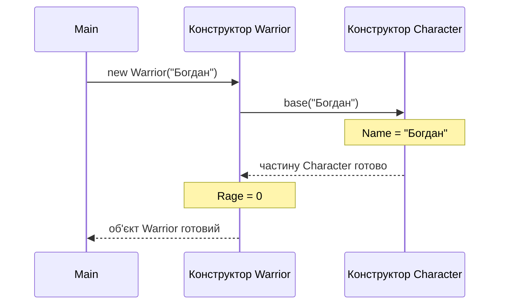
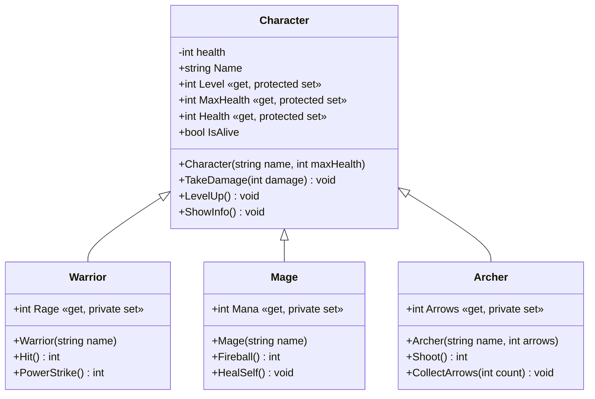
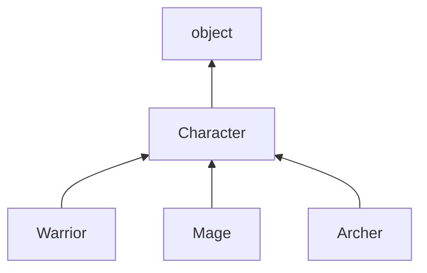
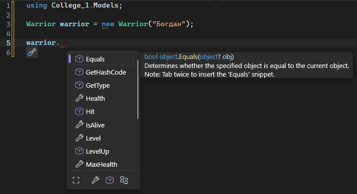

# 5. Наслідування: базовий та похідні класи

![block-badge] ![lang-badge]

> [!NOTE]
> **Про термін:** в українських джерелах цей принцип ООП називають по-різному — **наслідування**, **спадкування** або **успадкування**. Усі три слова означають одне й те саме (англійською — _inheritance_). У нашому курсі вживаємо «наслідування»: про класи кажемо «`Warrior` наслідує `Character`», а про їхні члени — «успадковуються». Тож, зустрівши інший варіант у книзі чи статті, знайте: йдеться про ту саму тему.

## Зміст
1. [Проблема дублювання коду](#проблема-дублювання-коду)
2. [Що таке наслідування](#що-таке-наслідування)
3. [Оголошення похідного класу](#оголошення-похідного-класу)
4. [Що успадковується](#що-успадковується)
5. [Конструктори та base](#конструктори-та-base)
6. [Ієрархія класів](#ієрархія-класів)
7. [Повний приклад](#повний-приклад)
8. [Порівняння наслідування та композиції](#порівняння-наслідування-та-композиції)
9. [Наслідування в реальних програмах](#наслідування-в-реальних-програмах)
10. [Підсумок](#підсумок)
11. [Запитання для самоперевірки](#запитання-для-самоперевірки)
12. [Довідкові матеріали](#довідкові-матеріали)

---

## Проблема дублювання коду

Створюємо рольову гру. У ній є різні типи персонажів: воїн, маг, лучник. Кожен має своє вміння: воїн б'є мечем і накопичує лють, маг витрачає ману на заклинання, лучник стріляє, доки є стріли.

Але в усіх персонажів є і **спільне**: ім'я, рівень, здоров'я, вміння отримувати шкоду й показувати інформацію про себе. Ось який вигляд мають воїн і маг, якщо писати їх окремо:

```C#
class Warrior
{
    public Warrior(string name)
    {
        Name = name;
        Level = 1;
        Health = 120;
    }

    public string Name { get; }
    public int Level { get; private set; }
    public int Health { get; private set; }
    public int Rage { get; private set; }

    public void TakeDamage(int damage)
    {
        Health -= damage;
        Console.WriteLine($"{Name} отримує {damage} шкоди, здоров'я: {Health}");
    }

    public void ShowInfo()
    {
        Console.WriteLine($"{Name}, рівень {Level}, здоров'я {Health}");
    }

    public int Hit()
    {
        Rage += 20;
        return 10;
    }
}

class Mage
{
    public Mage(string name)
    {
        Name = name;
        Level = 1;
        Health = 80;
        Mana = 100;
    }

    public string Name { get; }
    public int Level { get; private set; }
    public int Health { get; private set; }
    public int Mana { get; private set; }

    public void TakeDamage(int damage)
    {
        Health -= damage;
        Console.WriteLine($"{Name} отримує {damage} шкоди, здоров'я: {Health}");
    }

    public void ShowInfo()
    {
        Console.WriteLine($"{Name}, рівень {Level}, здоров'я {Health}");
    }

    public int Fireball()
    {
        Mana -= 30;
        return 35;
    }
}
```

Порівняйте класи: різняться лише кілька рядків, усе інше скопійовано.

| Член класу | `Warrior` | `Mage` |
| :---- | :---- | :---- |
| **`Name`, `Level`, `Health`** | ✅ | ✅ — копія |
| **`TakeDamage()`, `ShowInfo()`** | ✅ | ✅ — копія |
| **Власне вміння** | `Rage`, `Hit()` | `Mana`, `Fireball()` |

**Що з цим не так:**

- додаємо лучника — копіюємо все втретє, цілителя — вчетверте
- знайшли помилку в `TakeDamage` (здоров'я може стати від'ємним) — виправляти доведеться в кожному класі
- захотіли додати всім персонажам досвід — правимо всі класи і сподіваємося, що нічого не пропустили

В уроці 3 ми виносили спільні **перевірки** в допоміжний клас `Validator`. Але тут повторюються не перевірки, а самі **поля, властивості й методи**: допоміжний клас цього не прибере. Потрібен інший інструмент.

До речі, саме таке повторення залишилося і в уроці 3: властивості `Name` і `Age` у класах `Student` і `Teacher` майже однакові. Інструмент, який ми зараз розглянемо, вирішує і цю проблему: спільне можна винести в базовий клас `Person`, а студента й викладача зробити його різновидами (`class Student : Person`, `class Teacher : Person`).

---

## Що таке наслідування

> **Наслідування** (inheritance) — механізм ООП, за якого новий клас _створюється на основі наявного_ і автоматично отримує його поля, властивості та методи, додаючи до них власні.

Ідея проста: спільне для всіх персонажів описуємо **один раз** у класі `Character`, а воїн, маг і лучник беруть усе це «у спадок» і додають лише своє.

| Термін | Що означає | У нашому прикладі |
| :---- | :---- | :---- |
| **Базовий клас** (base class, батьківський) | Клас, який наслідують | `Character` |
| **Похідний клас** (derived class, дочірній) | Клас, який наслідує | `Warrior`, `Mage`, `Archer` |

Наслідування утворює зв'язок **«є»** (is-a). Перевірити його так само просто, як зв'язок «має» з уроку 4, — скласти речення:

| Речення | Наслідування? |
| :---- | :---- |
| **Воїн є персонажем** | ✅ `Warrior : Character` |
| **Маг є персонажем** | ✅ `Mage : Character` |
| **Автомобіль є транспортним засобом** | ✅ — той самий приклад з уроку 4 |
| **Воїн є мечем** | ❌ — воїн **має** меч, це зв'язок «має» (композиція чи агрегація) |

**Навіщо потрібне наслідування:**

- спільний код пишеться один раз — у базовому класі
- виправлення й нові можливості базового класу автоматично отримують усі похідні класи
- нові різновиди сутностей додаються швидко: достатньо описати лише те, чим вони відрізняються
- структура програми повторює логіку предметної області: «воїн — різновид персонажа»

---

## Оголошення похідного класу

Похідний клас оголошується через **двокрапку** після імені, за якою вказується базовий клас:

```C#
internal class Warrior : Character
{
    // лише те, що є тільки у воїна
}
```

Запис `Warrior : Character` читається як «`Warrior` наслідує `Character`» або «`Warrior` — це `Character`».

Ось базовий клас з усім спільним для персонажів:

```C#
namespace Game.Models;

internal class Character
{
    private int health;

    public Character(string name, int maxHealth)
    {
        Name = name;
        Level = 1;
        MaxHealth = maxHealth; // спершу максимум: властивість Health обмежує значення ним
        Health = maxHealth;
    }

    public string Name { get; }
    public int Level { get; protected set; }
    public int MaxHealth { get; protected set; }

    // Здоров'я завжди в межах від 0 до MaxHealth
    public int Health
    {
        get { return health; }
        protected set
        {
            if (value < 0)
            {
                health = 0;
            }
            else if (value > MaxHealth)
            {
                health = MaxHealth;
            }
            else
            {
                health = value;
            }
        }
    }

    public bool IsAlive
    {
        get { return Health > 0; }
    }

    public void TakeDamage(int damage)
    {
        Health -= damage;
        Console.WriteLine($"{Name} отримує {damage} шкоди, здоров'я: {Health}/{MaxHealth}");
        if (!IsAlive)
        {
            Console.WriteLine($"{Name} вибуває з бою");
        }
    }

    public void LevelUp()
    {
        Level++;
        MaxHealth += 10;
        Health = MaxHealth;
        Console.WriteLine($"{Name} досягає рівня {Level}");
    }

    public void ShowInfo()
    {
        Console.WriteLine($"{Name}, рівень {Level}, здоров'я {Health}/{MaxHealth}");
    }
}
```

А це воїн. Він містить **лише** те, чого немає в інших персонажів:

```C#
namespace Game.Models;

internal class Warrior : Character
{
    public Warrior(string name) : base(name, 120)
    {
        Rage = 0;
    }

    public int Rage { get; private set; }

    // Звичайний удар: завдає шкоди й накопичує лють
    public int Hit()
    {
        Rage += 20;
        Console.WriteLine($"{Name} б'є мечем (лють: {Rage})");
        return 10;
    }

    // Потужний удар: витрачає 40 люті
    public int PowerStrike()
    {
        if (Rage < 40)
        {
            Console.WriteLine($"{Name}: недостатньо люті для потужного удару");
            return 0;
        }
        Rage -= 40;
        Console.WriteLine($"{Name} завдає потужного удару!");
        return 25 + Level * 5;
    }
}
```

Два нові записи в цьому коді розберемо трохи нижче: `: base(name, 120)` передає ім'я та здоров'я конструктору `Character` (розділ «Конструктори та base»), а `protected set` — особливий рівень доступу для нащадків (розділ «Що успадковується»).

Зверніть увагу: у класі `Warrior` немає ні `Name`, ні `Level`, але методи воїна спокійно ними користуються. А в `Main` об'єкт воїна має доступ **і** до власних, **і** до успадкованих членів:

```C#
Warrior warrior = new Warrior("Богдан");
warrior.ShowInfo();           // метод з Character
warrior.TakeDamage(warrior.Hit()); // Hit — з Warrior, TakeDamage — з Character
warrior.ShowInfo();
```

Результат роботи:

```text
Богдан, рівень 1, здоров'я 120/120
Богдан б'є мечем (лють: 20)
Богдан отримує 10 шкоди, здоров'я: 110/120
Богдан, рівень 1, здоров'я 110/120
```

> [!IMPORTANT]
> **Ключова ідея:** об'єкт похідного класу містить **усе** з базового класу плюс власне. Воїн — це повноцінний персонаж (ім'я, рівень, здоров'я, отримання шкоди), який додатково вміє бити мечем.

---

## Що успадковується

Похідний клас отримує всі члени базового класу (крім конструкторів — про них нижче), але **користуватися** ними може не завжди — це залежить від модифікаторів доступу з уроку 2.

### private: успадковано, але недоступно

Поле `health` у `Character` приватне. Спробуємо змінити його напряму з класу воїна:

```C#
internal class Warrior : Character
{
    public Warrior(string name) : base(name, 120)
    {
        health = 200; // помилка компіляції
    }
}
```

Помилка компіляції:

```text
error CS0122: 'Character.health' is inaccessible due to its protection level
```

Поле `health` у кожного воїна **є** — без нього не працювало б здоров'я. Але звертатися до нього може тільки код усередині класу `Character`. Інкапсуляція діє навіть щодо «нащадків»: базовий клас сам стежить за своїми даними.

### protected: для своїх нащадків

В уроці 2 ми лише згадали модифікатор `protected`. Тепер він знадобився:

> **`protected`** — модифікатор доступу, за якого член класу _доступний усередині цього класу та всіх його похідних класів_, але недоступний ззовні.

У `Character` властивість здоров'я має `protected set`: змінювати здоров'я можуть і сам `Character`, і його нащадки, а зовнішній код — лише читати. Так маг може лікуватися власним заклинанням:

```C#
public void HealSelf()
{
    if (Mana < 20)
    {
        Console.WriteLine($"{Name}: недостатньо мани для лікування");
        return;
    }
    Mana -= 20;
    Health += 25; // protected set доступний у похідному класі
    Console.WriteLine($"{Name} лікується, здоров'я: {Health}/{MaxHealth}");
}
```

Зверніть увагу: маг змінює здоров'я **через властивість** `Health`, тож перевірка меж (від 0 до `MaxHealth`) спрацює і тут — вилікуватися понад максимум не вийде. А з `Main` змінити здоров'я напряму неможливо:

```C#
mage.Health = 1000; // помилка компіляції
```

Помилка компіляції:

```text
error CS0272: The property or indexer 'Character.Health' cannot be used in this context because the set accessor is inaccessible
```

### Підсумкова таблиця

| Модифікатор у базовому класі | Усередині базового класу | У похідному класі | Ззовні (напр. у `Main`) |
| :---- | :---- | :---- | :---- |
| **`public`** | ✅ | ✅ | ✅ |
| **`protected`** | ✅ | ✅ | ❌ |
| **`private`** | ✅ | ❌ | ❌ |

> [!TIP]
> **Порада:** не поспішайте робити поля `protected`. Як і раніше, поля краще залишати `private`, а нащадкам давати доступ через властивості з `protected set` — тоді перевірки базового класу працюватимуть для всіх.

---

## Конструктори та base

Конструктори **не успадковуються**. Але об'єкт воїна містить у собі «частину» персонажа: ім'я, рівень, здоров'я. Хтось має їх заповнити — і це робота конструктора `Character`.

> **`base(...)`** — виклик конструктора базового класу з конструктора похідного класу. Він пишеться _після двокрапки_ перед тілом конструктора.

```C#
public Warrior(string name) : base(name, 120)
{
    Rage = 0;
}
```

Цей запис означає: «щоб створити воїна, спочатку створи персонажа з ім'ям `name` і максимальним здоров'ям `120`, а потім виконай тіло конструктора воїна». Значення `120` воїн задає сам — так кожен різновид персонажа отримує свій запас здоров'я.

### Порядок виклику конструкторів

Додамо в конструктори повідомлення, щоб побачити, хто спрацьовує першим:

```C#
class Character
{
    public Character(string name)
    {
        Name = name;
        Console.WriteLine($"Конструктор Character: ім'я {Name}");
    }

    public string Name { get; }
}

class Warrior : Character
{
    public Warrior(string name) : base(name)
    {
        Rage = 0;
        Console.WriteLine($"Конструктор Warrior: лють {Rage}");
    }

    public int Rage { get; private set; }
}
```

```C#
Warrior warrior = new Warrior("Богдан");
```

Результат роботи:

```text
Конструктор Character: ім'я Богдан
Конструктор Warrior: лють 0
```

Спочатку завжди виконується конструктор **базового** класу, потім — **похідного**. Логіка та сама, що й у будівництві: спершу фундамент, потім стіни. Конструктор воїна може спокійно користуватися `Name`, бо на момент його виконання частина `Character` уже готова.



На схемі: `new Warrior(...)` спершу передає керування конструктору `Character` через `base(...)`, і лише після нього виконується тіло конструктора `Warrior`.

> [!WARNING]
> **Часта помилка:** забути `: base(...)`, коли в базового класу є лише конструктор з параметрами:
> ```C#
> public Warrior(string name) // немає : base(...)
> {
>     Rage = 0;
> }
> ```
> Помилка компіляції:
> ```text
> error CS7036: There is no argument given that corresponds to the required parameter 'name' of 'Character.Character(string, int)'
> ```
> Без `base(...)` компілятор намагається викликати конструктор `Character` **без параметрів** — а такого немає. Помилка та сама, що і в уроці 1, коли ми писали `new Phone()` для класу з конструктором з параметрами.

---

## Ієрархія класів

Базовий клас разом з усіма похідними утворює **ієрархію класів**. На діаграмі класів (UML) наслідування позначається стрілкою з **порожнім трикутником**, що вказує на базовий клас:



На діаграмі: спільні члени описані один раз — у `Character`, а кожен похідний клас містить лише своє.

### Лише один базовий клас

У C# клас може мати **тільки один** базовий клас. Припустимо, у проєкті є ще клас `Hero`, і ми спробуємо наслідувати обидва:

```C#
internal class Hero
{
}

internal class Warrior : Character, Hero // помилка компіляції
{
}
```

Помилка компіляції:

```text
error CS1721: Class 'Warrior' cannot have multiple base classes: 'Character' and 'Hero'
```

Зате ієрархія може мати кілька рівнів: наприклад, клас `Necromancer` може наслідувати `Mage` — тоді некромант отримає все від мага, а маг — від персонажа.

### Спільний предок усіх класів — object

Навіть якщо базовий клас не вказано, він усе одно є. Кожен клас у C# неявно наслідує клас **`object`** (повна назва — `System.Object`). Тож справжня ієрархія наших персонажів виглядає так:



На схемі: стрілки ведуть від похідного класу до базового, а на самій вершині — `object`.

Саме від `object` усі класи отримують кілька методів, які ви, можливо, вже помічали в підказках Visual Studio: `Equals()`, `GetHashCode()`, `GetType()` і `ToString()`. Наприклад, `GetType()` повертає тип об'єкта, а `GetType().BaseType` — його базовий клас:

```C#
Warrior warrior = new Warrior("Богдан");
Console.WriteLine(warrior.GetType());
Console.WriteLine(warrior.GetType().BaseType);
```

Результат роботи:

```text
Game.Models.Warrior
Game.Models.Character
```

Тип виводиться з повним ім'ям — разом із простором імен `Game.Models`, як ми бачили в уроці 3.



У підказці Visual Studio члени всіх рівнів ієрархії йдуть одним списком: власний метод воїна `Hit`, успадковані від `Character` `Health`, `LevelUp`, `MaxHealth`… та методи `object` — `Equals`, `GetType`, `GetHashCode`. Підказка праворуч прямо вказує, що `Equals` належить класу `object`.

> [!WARNING]
> **Часта помилка:** написати в похідному класі метод з **тим самим ім'ям**, що й у базовому, наприклад власний `ShowInfo()` у `Warrior`.
>
> Попередження компілятора:
> ```text
> warning CS0108: 'Warrior.ShowInfo()' hides inherited member 'Character.ShowInfo()'. Use the new keyword if hiding was intended.
> ```
> Компілятор попереджає: новий метод **приховує** успадкований, і це часто призводить до плутанини. Як правильно змінювати поведінку успадкованих методів — розберемо в окремій темі. Поки що похідні класи лише **додають** нові члени: дайте методу інше ім'я (наприклад, `ShowRage()`) і не додавайте слово `new`, яке пропонує компілятор.

---

## Повний приклад

Зберемо всю ієрархію персонажів у проєкт і влаштуємо тренувальний бій.

### Проєкт

```
Game/
├── Program.cs
└── Models/
    ├── Character.cs
    ├── Warrior.cs
    ├── Mage.cs
    └── Archer.cs
```

Файли `Models/Character.cs` і `Models/Warrior.cs` — такі самі, як у розділі «Оголошення похідного класу».

#### `Models/Mage.cs` — маг

```C#
namespace Game.Models;

internal class Mage : Character
{
    public Mage(string name) : base(name, 80)
    {
        Mana = 100;
    }

    public int Mana { get; private set; }

    public int Fireball()
    {
        if (Mana < 30)
        {
            Console.WriteLine($"{Name}: недостатньо мани для вогняної кулі");
            return 0;
        }
        Mana -= 30;
        Console.WriteLine($"{Name} кидає вогняну кулю (мана: {Mana})");
        return 35;
    }

    public void HealSelf()
    {
        if (Mana < 20)
        {
            Console.WriteLine($"{Name}: недостатньо мани для лікування");
            return;
        }
        Mana -= 20;
        Health += 25; // protected set доступний у похідному класі
        Console.WriteLine($"{Name} лікується, здоров'я: {Health}/{MaxHealth}");
    }
}
```

#### `Models/Archer.cs` — лучник

```C#
namespace Game.Models;

internal class Archer : Character
{
    public Archer(string name, int arrows) : base(name, 90)
    {
        Arrows = arrows;
    }

    public int Arrows { get; private set; }

    public int Shoot()
    {
        if (Arrows == 0)
        {
            Console.WriteLine($"{Name}: стріли закінчились");
            return 0;
        }
        Arrows--;
        Console.WriteLine($"{Name} стріляє з лука (стріл: {Arrows})");
        return 15;
    }

    public void CollectArrows(int count)
    {
        Arrows += count;
        Console.WriteLine($"{Name} збирає стріли (стріл: {Arrows})");
    }
}
```

Зверніть увагу на конструктор лучника: він сам приймає параметр `arrows`, якого немає в `Character`, а в `base(...)` передає лише те, що потрібно базовому класу.

#### `Program.cs` — точка входу

```C#
using Game.Models;

namespace Game;

class Program
{
    static void Main(string[] args)
    {
        Warrior warrior = new Warrior("Богдан");
        Mage mage = new Mage("Злата");
        Archer archer = new Archer("Остап", 2);

        warrior.ShowInfo();
        mage.ShowInfo();
        archer.ShowInfo();
        Console.WriteLine();

        // Тренувальний бій: воїн проти мага
        mage.TakeDamage(warrior.Hit());
        mage.TakeDamage(warrior.Hit());
        mage.TakeDamage(warrior.PowerStrike());
        mage.HealSelf();
        warrior.TakeDamage(mage.Fireball());
        Console.WriteLine();

        // Лучник тренується на воїні
        warrior.TakeDamage(archer.Shoot());
        warrior.TakeDamage(archer.Shoot());
        archer.Shoot();
        archer.CollectArrows(5);
        Console.WriteLine();

        warrior.LevelUp();
        warrior.ShowInfo();
        mage.ShowInfo();
        archer.ShowInfo();
    }
}
```

Результат роботи:

```text
Богдан, рівень 1, здоров'я 120/120
Злата, рівень 1, здоров'я 80/80
Остап, рівень 1, здоров'я 90/90

Богдан б'є мечем (лють: 20)
Злата отримує 10 шкоди, здоров'я: 70/80
Богдан б'є мечем (лють: 40)
Злата отримує 10 шкоди, здоров'я: 60/80
Богдан завдає потужного удару!
Злата отримує 30 шкоди, здоров'я: 30/80
Злата лікується, здоров'я: 55/80
Злата кидає вогняну кулю (мана: 50)
Богдан отримує 35 шкоди, здоров'я: 85/120

Остап стріляє з лука (стріл: 1)
Богдан отримує 15 шкоди, здоров'я: 70/120
Остап стріляє з лука (стріл: 0)
Богдан отримує 15 шкоди, здоров'я: 55/120
Остап: стріли закінчились
Остап збирає стріли (стріл: 5)

Богдан досягає рівня 2
Богдан, рівень 2, здоров'я 130/130
Злата, рівень 1, здоров'я 55/80
Остап, рівень 1, здоров'я 90/90
```

Подивіться, звідки беруться значення: потужний удар воїна завдав `30` шкоди (`25 + Level * 5`, де `Level` успадкований від `Character`), а після підвищення рівня здоров'я воїна зросло до `130` — метод `LevelUp()` написаний один раз у базовому класі, але працює для будь-якого персонажа.

### Члени класів ієрархії

| Клас | Власні члени | Успадковані від `Character` |
| :---- | :---- | :---- |
| **`Character`** | `Name`, `Level`, `MaxHealth`, `Health`, `IsAlive`, `TakeDamage()`, `LevelUp()`, `ShowInfo()` | — |
| **`Warrior`** | `Rage`, `Hit()`, `PowerStrike()` | усі члени `Character` |
| **`Mage`** | `Mana`, `Fireball()`, `HealSelf()` | усі члени `Character` |
| **`Archer`** | `Arrows`, `Shoot()`, `CollectArrows()` | усі члени `Character` |

> [!IMPORTANT]
> **Ключова ідея:** щоб додати в гру цілителя, тепер достатньо створити клас `Healer : Character` з одним-двома власними методами. Ім'я, рівень, здоров'я, отримання шкоди й підвищення рівня він отримає автоматично — і всі виправлення в `Character` теж.

---

## Порівняння наслідування та композиції

В уроці 4 ми будували об'єкти з частин (композиція та агрегація), а тепер — на основі інших класів. Обидва способи дозволяють повторно використовувати код, але моделюють **різні** зв'язки.

| Критерій | Наслідування | Композиція / агрегація |
| :---- | :---- | :---- |
| **Зв'язок** | «є» (is-a): воїн **є** персонажем | «має» (has-a): автомобіль **має** двигун |
| **Запис у коді** | `class Warrior : Character` | поле `private Engine engine;` |
| **Що отримує клас** | Усі члени базового класу (крім конструкторів) автоматично | Лише те, що частина відкриває через свої публічні члени |
| **Скільки можна** | Лише один базовий клас | Скільки завгодно частин |
| **Зміна зв'язку під час роботи програми** | Неможлива: воїн назавжди залишиться персонажем | Можлива: агреговану частину можна замінити |
| **Позначення в UML** | Порожній трикутник △ | Ромб ◆ / ◇ |

**Головна різниця** — наслідування відповідає на питання «**ким** є об'єкт», а композиція — «**з чого** він складається». Тому в нашій грі воїн _наслідує_ персонажа, але меч, броню чи інвентар він _має_ — і їх варто робити окремими класами-частинами.

> [!WARNING]
> **Часта помилка:** наслідувати лише для того, щоб «отримати потрібні методи». Наприклад, `class Warrior : Sword`, бо воїну потрібна шкода меча. Перевірте реченням: «воїн **є** мечем» — нісенітниця. Отже, тут потрібен зв'язок «має»: у воїна є поле з мечем.

---

## Наслідування в реальних програмах

Ви вже користувалися наслідуванням, навіть не помічаючи цього:

| Де | Запис у коді | Що дає |
| :---- | :---- | :---- |
| **Будь-який клас C#** | неявно `: object` | Методи `ToString()`, `Equals()`, `GetType()` у кожного об'єкта |
| **[Unity](https://docs.unity3d.com/ScriptReference/MonoBehaviour.html)** | `class Player : MonoBehaviour` | Кожен скрипт-компонент наслідує `MonoBehaviour` і отримує доступ до ігрового об'єкта, його компонентів і подій рушія |
| **[Windows Forms](https://learn.microsoft.com/dotnet/desktop/winforms/)** | `class MainForm : Form` | Власне вікно програми наслідує готове вікно з рамкою, заголовком і кнопками |

Особливо показовий Unity: в уроці 4 ми згадували, що ігрові об'єкти там _складаються_ з компонентів (композиція). А кожен компонент-скрипт, який пише розробник, _наслідує_ `MonoBehaviour`. Тобто у справжніх проєктах обидва підходи працюють разом: наслідування — щоб отримати можливості рушія, композиція — щоб зібрати з компонентів конкретний об'єкт.

---

## Підсумок

- **наслідування** дозволяє створити клас на основі наявного: похідний клас отримує члени базового й додає власні
- похідний клас оголошується через двокрапку: `class Warrior : Character`; наслідування моделює зв'язок «є» (is-a)
- `private`-члени базового класу недоступні навіть у похідному класі, а `protected` — доступні в базовому класі та його нащадках, але не ззовні
- конструктори не успадковуються: похідний клас викликає конструктор базового через `base(...)`, і базовий виконується першим
- у C# лише один базовий клас, а вершина будь-якої ієрархії — `object`

---

## Запитання для самоперевірки

1. Яку проблему вирішує наслідування? Чому її не можна вирішити допоміжним статичним класом?
2. Що таке базовий і похідний клас? Наведіть власний приклад.
3. Як перевірити, чи доречне наслідування між двома класами?
4. Чи є в об'єкта `Warrior` поле `health`? Чи може код класу `Warrior` звернутися до нього?
5. Чим `protected` відрізняється від `private` і `public`?
6. Навіщо потрібен `base(...)`? Що станеться, якщо його не написати?
7. У якому порядку виконуються конструктори базового та похідного класів? Чому саме так?
8. Скільки базових класів може мати клас у C#? Який клас є спільним предком усіх класів?
9. «Магазин має товари», «Студент є людиною», «Ноутбук є комп'ютером», «Ноутбук має клавіатуру» — де доречне наслідування, а де композиція?

---

## Довідкові матеріали

У статтях Microsoft трапляються слова `virtual`, `override` і `abstract` — це окрема тема, поки що їх можна пропустити.

- [Успадкування (програмування)](https://uk.wikipedia.org/wiki/%D0%A3%D1%81%D0%BF%D0%B0%D0%B4%D0%BA%D1%83%D0%B2%D0%B0%D0%BD%D0%BD%D1%8F_(%D0%BF%D1%80%D0%BE%D0%B3%D1%80%D0%B0%D0%BC%D1%83%D0%B2%D0%B0%D0%BD%D0%BD%D1%8F)) — `uk.wikipedia.org`
- [Object-oriented programming - inheritance](https://learn.microsoft.com/dotnet/csharp/fundamentals/object-oriented/inheritance) — `learn.microsoft.com`
- [Tutorial: Introduction to Inheritance](https://learn.microsoft.com/dotnet/csharp/fundamentals/tutorials/inheritance) — `learn.microsoft.com`
- [The base keyword](https://learn.microsoft.com/dotnet/csharp/language-reference/keywords/base) — `learn.microsoft.com`
- [protected keyword](https://learn.microsoft.com/dotnet/csharp/language-reference/keywords/protected) — `learn.microsoft.com`
- [Object Class](https://learn.microsoft.com/dotnet/api/system.object) — `learn.microsoft.com`
- [Composition over inheritance](https://en.wikipedia.org/wiki/Composition_over_inheritance) — `en.wikipedia.org`

---
[block-badge]:https://img.shields.io/badge/%D0%9E%D0%9E%D0%9F-purple?style=flat
[lang-badge]:https://img.shields.io/badge/C%23-blue?style=flat&logo=dotnet
